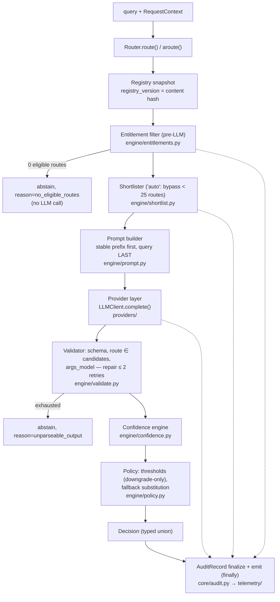

# Orchestration Agent — Complete Build Plan

**Project:** `switchboard` (working name — trivially renameable: one `sed` over `src/switchboard`, the pyproject `name`, and docs; claim the PyPI name in week 1)
**Source:** [Building a Framework-Agnostic, LLM-Fir.md](Building%20a%20Framework-Agnostic,%20LLM-Fir.md) (the research report; authoritative evidence base)
**Date:** 2026-08-07 · **License:** MIT · **Language:** Python 3.10+ · **Core dependency:** Pydantic v2 only

---

## Current implementation status

This plan is the target architecture and roadmap. The current source tree has
implemented the v0.1 core package plus a few hardening items that were originally
listed as later work. Treat the table below as the source-of-truth bridge between
the roadmap names in this document and the files that exist today.

| Area named in this plan | Current status in this checkout |
|---|---|
| `src/switchboard/router.py`, `core/`, `engine/`, provider protocols, BYO callable, Instructor and LiteLLM adapters | Implemented. |
| `src/switchboard/cli.py` and `switchboard` entry point | Implemented as a narrow stdlib CLI: `version`, `eval dogfood`, and `eval inspect`. Full `lint|enrich|distill|costs` command set remains roadmap work. |
| Bounded queued audit sink | Implemented as `QueuedSink`; OTLPSink remains roadmap work. |
| Distillation exporter | Implemented as stdlib JSONL helpers in `switchboard.distill`; Parquet export and model training remain roadmap work. |
| Native `openai_adapter.py` | Implemented. |
| Native `anthropic_adapter.py`, `gemini_adapter.py`, `bedrock_adapter.py` | Not implemented; use `instructor:` or `litellm:` adapters. |
| `streaming.py` / streaming route API | Not implemented; `Router.stream_route()` and `Router.astream_route()` deliberately raise. |
| `hierarchy.py` / hierarchical routing | Not implemented. |
| Full eval CLI, YAML gates, rich reports, external benchmark adapters | Not implemented; core fixtures, replay cache, and runner are implemented. |
| OpenTelemetry GenAI metrics | Not implemented; spans are implemented. |

---

## 1. Executive summary & positioning

**Verdict (from the report): build it, scoped tightly to the decision contract.** No incumbent occupies the niche of a *framework-agnostic, LLM-first, registry-driven route/tool selector* with a typed decision contract. The gap is real but narrow and closing (Anthropic Tool Search, ADK/OpenAI handoffs, ToolRegistry, semantic-router all encroach) — so the MVP ships in **6 weeks**, not quarters.

**Positioning statement:** *"The bring-your-own-model decision layer: one typed `route()` call that picks among your tools/routes, extracts args, asks for clarification, or abstains — in any framework, with any provider, with an audit trail you can distill."*

Explicit **non-goals**: not a gateway, not an agent framework, not embedding-only, and it **decides, never executes** — execution authority stays with the caller.

**The moat** is the decision contract, not the model call:

- A typed, provider-agnostic `Decision` discriminated union: `route | multi_route | clarify | abstain` (+ `plan` at v0.5), with validated args, confidence, and a full audit record on every outcome.
- Constrained-decoding enforcement with a graceful-degradation ladder (never a flat lowest-common-denominator abstraction).
- Multi-tenant entitlement filtering as a pre-LLM security boundary that also shrinks the prompt (an accuracy win).
- Decision-log capture from day one: the audit record **is** the OTel span payload **is** the distillation training example — the compounding asset.
- An eval harness users run on **their own catalog**, with the report's go/no-go gates encoded as CI thresholds.

**Evidence pillars the design must honor** (all designs below trace to these):

| Finding | Source | Design consequence |
|---|---|---|
| Tool selection collapses to 13.62% at scale; retrieval shortlisting more than triples it (43.13%) and cuts prompt tokens >50% | RAG-MCP, arXiv 2505.03275 | Retrieve-then-decide is the default loop; shortlist to small K |
| Near-perfect retrieval at K=100 still yields near-random selection (−10–16 pts, 10× tokens) | "99% Success Paradox", arXiv 2605.18857 | K clamped to [5, 20]; never dump large candidate sets |
| Degradation begins ~30–50 tools (Anthropic docs), <20 advised (OpenAI); 128-tool API hard cap | vendor docs | Skip shortlist below ~25 routes; warn above 50 candidates |
| Position bias is architectural; shuffled toolset dropped success 41%→27% | BiasBusters 2510.00307; 2407.03007 | Small K + seeded-shuffle candidate order; shuffle robustness test in eval |
| 110-agent catalog: routing F1 −16–23 pts at scale; shortlist recovers +10–11 F1; error = retrieval gap + confusion gap | arXiv 2606.17519 | Gap decomposition is a first-class eval metric |
| Constrained decoding ≈ −2 pts vs native FC if over-constrained; in-schema free-text rationale mitigates | BAML; "Let Me Speak Freely?" | Wire schema places `rationale` **before** the committed `route` field |
| Verbalized confidence "tracks commitment more than correctness"; logprobs discriminate better; self-consistency helps at cost | arXiv 2601.07767, 2606.29490 | Logprob-first confidence ladder; conservative thresholds; verbalized recorded but inert by default |
| Small non-reasoning models route sub-second; reasoning modes inflate TTFT to seconds | pricing/TTFT snapshots in report | Reasoning forced OFF in all adapters; model IDs are data, not code |
| Prompt caching ≈ 90% input discount on stable prefixes | provider docs | Prompt layout is stable→variable with explicit cache keys |
| Unbounded transitive pin enabled CVE-2026-42208 credential exfiltration | semantic-router incident | Pydantic-only core; every extra upper-bounded; lazy SDK imports |

---

## 2. System architecture

### 2.1 Canonical decision loop

**entitlement filter → optional shortlist (K≈5–20) → structured LLM decision (constrained decoding, in-schema rationale before the committed route) → validate → policy (thresholds/fallback) → audit emit.**



The audit emitter is a tap, not a stage: every step appends to a mutable `LoopState`; the `AuditRecord` is frozen once, after the Decision is final, and emitted exactly once — in a `finally`, so raised provider errors still produce a span with `error.type` set.

### 2.2 Component ownership

| Component | Owning module | Responsibility | Phase |
|---|---|---|---|
| Registry | `core/registry.py` | Immutable catalog; content-hash → `registry_version`; tenant views | [v0.1] (views [v0.2]) |
| Entitlement filter | `engine/entitlements.py` | Pre-LLM predicate filter → eligible set + `entitlement_key` | [v0.2] (documented no-op passthrough stub [v0.1]) |
| Shortlister | `engine/shortlist.py` | `Shortlister` Protocol + pure-Python BM25 default; `"auto"` bypass < 25 routes | [v0.1] |
| Prompt builder | `engine/prompt.py` | Cache-stable segments: system → route directory → candidates → query LAST | [v0.1] |
| Provider layer | `providers/` | `LLMClient` Protocols, capability flags, spec-string resolver, adapters | [v0.1] |
| Wire schema | `engine/schema.py` | Per-call output schema: `rationale` first, route enum, args | [v0.1] |
| Validator | `engine/validate.py` | Parse, route-existence check, args validation, bounded repair (2 retries) | [v0.1] |
| Confidence engine | `engine/confidence.py` | Logprob `p_route` [v0.1]; margin + self-consistency vote [v0.2]; verbalized recorded-only | [v0.1]/[v0.2] |
| Policy resolver | `engine/policy.py` | Thresholds (downgrade-only) → final kind; fallback substitution | [v0.1] |
| Decision contract | `core/decision.py` | `Decision` union + closed abstain-reason enum | [v0.1] (`plan` [v0.5]) |
| Audit + telemetry | `core/audit.py` + `telemetry/` | One `AuditRecord` = OTel span payload = distillation row; sinks | [v0.1] (OTel spans [v0.1] via `[otel]` extra) |
| Eval harness | `evals/` | Fixtures + replay cache [v0.1]; full gates/CLI [v0.2] | [v0.1]/[v0.2] |
| Distillation | `distill/` | Log → dataset → classifier fast path | [v0.5] |
| Hierarchical routing | `engine/hierarchy.py` | Two-level decide-then-decide for 1k+ catalogs | [v0.5] |

### 2.3 Repository layout (`src/` layout)

```
src/switchboard/
├── __init__.py            # Public API re-exports ONLY (never imports adapters)
├── py.typed               # PEP 561
├── _version.py            # hatch-vcs dynamic version
├── _models.py             # model-ID data: capabilities, prices, deprecated_after dates
├── errors.py              # unified exception taxonomy (§3.8); stdlib-only
├── router.py              # Router: config wiring + route()/aroute() drivers        [v0.1]
├── streaming.py           # stream_route(): rationale deltas, atomic commit         [v0.2]
├── cli.py                 # root `switchboard` CLI: eval|lint|enrich|distill|costs  [v0.2]
├── core/
│   ├── route.py           # Route model                                             [v0.1]
│   ├── registry.py        # Registry: frozen, content hash, view(ctx)               [v0.1]
│   ├── context.py         # RequestContext                                          [v0.1]
│   ├── decision.py        # Decision union + AbstainReason enum + ConfidenceReport  [v0.1]
│   ├── audit.py           # AuditRecord (canonical; §8.2)                           [v0.1]
│   └── candidates.py      # Candidate / ShortlistResult (single shared model)       [v0.1]
├── engine/
│   ├── loop.py            # pure (LoopState) -> LoopState steps; ONE pipeline       [v0.1]
│   ├── entitlements.py    # filter(registry, ctx) -> (eligible, entitlement_key)    [v0.2; stub v0.1]
│   ├── shortlist.py       # Shortlister Protocol; BM25Shortlister (pure Python);
│   │                      #   EmbeddingShortlister (BYO embed callable)             [v0.1]
│   ├── prompt.py          # segmented assembly, cache breakpoints, seeded shuffle   [v0.1]
│   ├── schema.py          # per-call wire schema (rationale-first)                  [v0.1]
│   ├── validate.py        # parse + candidate check + args + repair loop            [v0.1]
│   ├── confidence.py      # p_route [v0.1]; margin, vote, fusion, calibrate         [v0.2]
│   ├── policy.py          # ThresholdPolicy → final kind; fallback                  [v0.1]
│   └── hierarchy.py       # two-level routing                                       [v0.5]
├── providers/
│   ├── __init__.py        # resolve("instructor:openai/gpt-5-nano"); lazy import;
│   │                      #   raises MissingDependencyError naming the extra        [v0.1]
│   ├── base.py            # LLMClient/AsyncLLMClient, LLMRequest/LLMResult,
│   │                      #   ClientCapabilities, TokenLP (normative; §4.1)         [v0.1]
│   ├── callable_adapter.py# BYO plain callable (sync/async auto-detected)           [v0.1]
│   ├── instructor_adapter.py  # [instructor] default path                           [v0.1]
│   ├── litellm_adapter.py     # [litellm] broadest matrix                           [v0.1]
│   ├── openai_adapter.py      # [openai] strict Structured Outputs + logprobs       [v0.2]
│   ├── anthropic_adapter.py   # [anthropic] forced tool + cache_control             [v0.2]
│   ├── gemini_adapter.py      # [gemini] responseSchema + propertyOrdering          [v0.2]
│   └── bedrock_adapter.py     # [bedrock] Converse API                              [v0.5]
├── shortlisters/
│   └── embedding_backends.py  # [embed] fastembed/openai-embed backends             [v0.2]
├── telemetry/
│   ├── emitter.py         # DecisionSink Protocol + InMemory/JSONL/Callback sinks   [v0.1]
│   └── otel.py            # [otel] gen_ai.* span emission (API-only dep)            [v0.1]
├── evals/                 # note: `evals`, not `eval` (stdlib shadow)
│   ├── fixtures.py        # EvalCase schema, registry.to_fixture(), replay cache    [v0.1]
│   ├── harness.py         # runner, metrics, baselines, gates                       [v0.1 minimal; v0.2 full]
│   └── adapters.py        # bfcl-v4-subset / metatool-199 / stress-N converters     [v0.2]
└── distill/
    ├── export.py          # AuditRecords → training set                             [v0.5]
    └── classifier.py      # distilled fast path + shadow/promote/demote             [v0.5]
```

### 2.4 Zero-hard-dependency enforcement (structural, not aspirational)

- **Manifest:** `dependencies = ["pydantic>=2.7,<3"]` — nothing else, ever. All SDKs live in `[project.optional-dependencies]` with **bounded ranges** (CVE-2026-42208 lesson).
- **Import topology rule:** optional third-party imports are permitted only at the top of `providers/*_adapter.py`, `shortlisters/embedding_backends.py`, and `telemetry/otel.py`. `core/`, `engine/`, `errors.py`, `router.py` may never import them; `__init__.py` never imports any adapter.
- **Lazy resolution:** `providers.resolve(spec)` imports via `importlib` inside the call; `ImportError` → `MissingDependencyError` naming the exact extra. Resolution happens **eagerly at `Router(...)` construction** so missing extras fail fast, not on the first request.
- **CI guards (both blocking) [v0.1]:** (1) *bare-venv test* — install with only Pydantic, run a route with a BYO callable, assert `sys.modules` contains nothing from a deny-list (`openai`, `litellm`, `instructor`, `anthropic`, `boto3`, `opentelemetry`, `fastembed`, `numpy`); (2) *import-linter contract* forbidding `core|engine|router → adapters/extras`.
- **Capability degradation, not flattening** (report risk #3): adapters declare `ClientCapabilities`; the engine branches — no strict schema → validate-and-retry; no logprobs → confidence ladder drops a rung; no explicit caching → prompt still cache-shaped for implicit caching.

### 2.5 Sync/async execution model

- **One pipeline, two drivers.** All steps in `engine/loop.py` are pure `(LoopState) -> LoopState` functions; the only I/O points are the provider call and telemetry flush. `route()` and `aroute()` are ~30-line drivers over identical steps — parity is structural. No `unasync` codegen.
- **Mismatch rules:** sync `route()` + async-only client → `ConfigError` at construction; async `aroute()` + sync-only client → wrapped in `asyncio.to_thread` (documented).
- **Self-consistency [v0.2]:** `aroute()` fans out votes via `asyncio.gather`; `route()` samples sequentially (documented latency note).
- **Thread safety:** `Registry` frozen after construction; `Router` holds no per-request mutable state; one instance is safe across threads and tasks.

---

## 3. Public API & decision contract

Everything importable from the top level: `from switchboard import Route, Registry, Router, RequestContext, Decision`.

Decisions the report left open, resolved here: **(a)** `Route` carries no handler — decisions only, execution stays caller-side; a handler ref belongs in `metadata`. **(b)** The LLM-emitted *wire schema* is generated per call and is distinct from the returned `Decision`; `confidence` and `audit` are library-attached (single exception: on the verbalized rung a `stated_confidence` field is appended to the wire schema *after* `route`/`args`, post-commitment, and is damped at fusion). **(c)** An empty post-entitlement candidate set **degrades to `abstain(reason="no_eligible_routes")` with no LLM call** — clarify/abstain are results, not exceptions; the audit record makes it observable. **(d)** `Registry` is frozen after construction; composition returns a new object — required for stable content-hash cache keying.

### 3.1 Route [v0.1]

```python
class Route(BaseModel):
    model_config = ConfigDict(frozen=True, arbitrary_types_allowed=True)
    name: str                                  # ^[a-z][a-z0-9_\-.:]{0,63}$; unique per Registry; wire-enum member
    description: str                           # 1–3 sentences, prompt-facing; write as "description-as-prompt"
    args_model: type[BaseModel] | None = None  # args extracted in the same LLM call; None = no args
    examples: tuple[str, ...] = ()             # few-shot utterances; also indexed by the shortlister
    tags: frozenset[str] = frozenset()         # shortlist field boost, grouping, coarse classes
    pinned: bool = False                       # always appended to candidates regardless of score  [v0.1]
    requires: frozenset[str] = frozenset()     # declarative entitlement: ctx.entitlements ⊇ requires
                                               #   (hashable → feeds entitlement_key/view caching)   [v0.2]
    visibility: Callable[[RequestContext], bool] | None = None   # escape-hatch predicate; sync, pure, O(µs) [v0.2]
    clarify_label: str | None = None           # human phrase for templated clarify questions        [v0.2]
    group: str | None = None                   # hierarchical routing group                          [v0.5]
    metadata: dict[str, Any] = {}              # opaque passthrough (handler ref, owner, cost class)

    @property
    def content_hash(self) -> str: ...         # sha256 over canonical JSON of (name, description,
                                               #   args_model JSON-schema, examples, tags, requires,
                                               #   metadata); `visibility` excluded (non-serializable) [v0.1]
```

Per-route `threshold_policy` overrides for high-stakes routes arrive at [v0.5]. `Route.from_function(fn)` [v0.2] infers name/description/args_model from signature + docstring (interop with plain tools and ToolRegistry-style catalogs).

### 3.2 Registry [v0.1]

```python
reg = Registry(routes)                    # validates unique names; frozen after __init__
reg2 = reg | other                        # union; duplicate name -> RegistryError
reg3 = reg.merge(other, on_conflict="error" | "override" | "keep")
sub  = reg.filter(lambda r: "billing" in r.tags)
reg.version                               # [v0.1] 12-hex prefix of sha256 over sorted route content-hashes;
                                          #   stamped into every Decision/audit; keys prompt-cache + indexes
view = reg.view(ctx)                      # [v0.2] frozen RegistryView: entitlement-filtered routes + view_hash
reg.diff(other) -> RegistryDiff           # [v0.2] {added, removed, changed}
reg.on_version_change(callback)           # [v0.2] invalidation hook
```

### 3.3 Router config surface

Every string-DSL value has an equivalent object form (`ClientSpec.parse(s)` etc.); DSL grammar `scheme[+scheme]:key=value,...`. Object forms are the stable API; strings are sugar.

| Param | String DSL example | Object form | Default | Phase |
|---|---|---|---|---|
| `client` | `"instructor:openai/gpt-5-nano"`, `"litellm:gemini/gemini-2.5-flash-lite"` | `ClientSpec(adapter, model, temperature=0.0, want_logprobs=True)`, any `LLMClient`, or a plain callable | — (required) | v0.1 |
| `shortlist` | `"auto"`, `"bm25:top_k=10"`, `"embed:model=..."`, `"hybrid"` | `ShortlistSpec` \| `Shortlister` instance \| `None` | `"auto"` (bypass < 25 routes, else BM25) | v0.1 (embed backends/hybrid v0.2) |
| `shortlist_k` | — | `int`, clamped [5, 20] | `10` | v0.1 |
| `shortlist_min_routes` | — | `int` | `25` | v0.1 |
| `multi_route` | — | `bool` | `False` | v0.1 |
| `allow_clarify` | — | `bool` | `True` | v0.1 |
| `allow_plan` | — | `bool` | `False` | v0.5 |
| `fallback` | `"human_handoff"` | registered route name \| `None` | `None` | v0.1 |
| `confidence` | `"logprobs"`, `"logprobs+vote:n=3"`, `"none"` | `ConfidenceSpec(source, vote_n=1)` | `"logprobs"` (inert when client lacks logprobs; §6.3) | logprobs v0.1; vote/margin v0.2 |
| `thresholds` | — | `ThresholdPolicy(clarify_below=0.55, abstain_below=0.30, ...)` | as shown (§6.4) | v0.1 |
| `max_candidates` | — | `int` | `25` (warn > 50, per degradation evidence) | v0.1 |
| `candidate_order` | — | `"shuffle" \| "score" \| "registry"` | `"shuffle"` (seeded; §5.6) | v0.1 |
| `retry` | — | `RetrySpec(schema_attempts=2, provider_attempts=3, backoff="expo_jitter")` | as shown | v0.1 |
| `redactor` | — | `Callable[[str, RequestContext], str]` — one hook, three enforcement sites (§7.4) | `None` | v0.1 |
| `content_mode` | — | `"none" \| "redacted" \| "full"` | `"none"` (hash-only audit) | v0.1 |
| `wire_schema` | — | `"auto" \| "dynamic" \| "static"` (§4.4) | `"auto"` | v0.1 |
| `per_tenant_index` | — | `bool` | `False` | v0.2 |
| `on_provider_error` | — | `"raise" \| "abstain"` | `"raise"` | v0.2 |

If `shortlist=None` (explicitly disabled) and the entitled set exceeds `max_candidates`, the Router raises `ConfigError` — silent truncation would drop routes; `"auto"` never errors.

### 3.4 The Decision discriminated union [v0.1; `plan` v0.5]

```python
AbstainReason = Literal[                     # ONE closed enum, owned by core/decision.py; audit,
    "no_eligible_routes",                    #   distillation filters, and eval fixtures key on it
    "unparseable_output",
    "invalid_route_reference",
    "invalid_args",
    "low_confidence",
    "provider_error",
    "model_elected",
]

class ConfidenceReport(BaseModel):           # ONE confidence model, used in Decision AND AuditRecord (§6)
    score: float                             # fused scalar, 0–1; NOT a calibrated probability (documented)
    method: str                              # e.g. "logprobs", "logprobs+vote:n=3", "verbalized", "none"
    p_route: float | None = None             # geometric-mean prob of committed route tokens   [v0.1]
    margin: float | None = None              # first-divergent-token gap; None if uncomputable [v0.2]
    agreement: float | None = None           # self-consistency winner_votes / n               [v0.2]
    vote_overturned: bool = False            # majority overturned the greedy vote             [v0.2]
    stated: float | None = None              # verbalized, raw; recorded, damped, never solely trusted
    thresholds: dict[str, float] = {}        # thresholds as applied, e.g. {"clarify": 0.55, "abstain": 0.30}

class _DecisionBase(BaseModel):
    model_config = ConfigDict(frozen=True)
    rationale: str
    confidence: ConfidenceReport
    audit: AuditRecord                       # canonical record (§8.2); OTel payload; distillation row
    decision_path: Literal["llm", "distilled", "fallback"] = "llm"
    downgraded_from: str | None = None       # e.g. "route" when thresholds downgraded to clarify

class RoutedCall(BaseModel):
    route: str
    args: BaseModel | None = None            # instance of that route's args_model, fully validated

class RouteDecision(_DecisionBase):
    kind: Literal["route"] = "route"
    route: str                               # guaranteed ∈ entitled candidate set
    args: BaseModel | None = None

class MultiRouteDecision(_DecisionBase):
    kind: Literal["multi_route"] = "multi_route"
    routes: tuple[RoutedCall, ...]           # order-independent, parallel-safe

class ClarifyDecision(_DecisionBase):
    kind: Literal["clarify"] = "clarify"
    question: str
    candidates: tuple[str, ...] = ()         # routes it was torn between (enum-constrained in-schema)
    missing: tuple[str, ...] = ()            # arg fields it could not extract
    resume_token: str | None = None          # re-enter with prior shortlist pinned            [v0.2]

class AbstainDecision(_DecisionBase):
    kind: Literal["abstain"] = "abstain"
    reason: AbstainReason

class PlanStep(BaseModel):                   # [v0.5]
    route: str; args: BaseModel | None = None; depends_on: tuple[int, ...] = ()

class PlanDecision(_DecisionBase):           # [v0.5]
    kind: Literal["plan"] = "plan"
    steps: tuple[PlanStep, ...]              # topologically ordered

Decision = Annotated[
    RouteDecision | MultiRouteDecision | ClarifyDecision | AbstainDecision | PlanDecision,
    Field(discriminator="kind"),
]
```

**Fallback shape (one shape, everywhere):** a configured fallback resolves a terminal abstain into `RouteDecision` with `decision_path="fallback"` and `args=None`; the pre-fallback outcome and reason are preserved in `audit`. `AbstainDecision` is returned only when no fallback is configured or the fallback route is not entitled for this context. Downstream code branches on `kind` alone.

Wire-schema note: per call, the generated schema orders fields **`rationale` → `kind` → `route` → `args`** so free-text reasoning is emitted *before* the committed route token (the reason-then-commit pattern the evidence supports). See §4.4 for the dynamic-vs-static enum strategy.

### 3.5 RequestContext [v0.1; entitlement use v0.2]

```python
class RequestContext(BaseModel):
    model_config = ConfigDict(frozen=True)
    tenant_id: str | None = None
    user_id: str | None = None
    entitlements: frozenset[str] = frozenset()   # consumed by Route.requires / visibility predicates
    entitlement_key: str | None = None           # caller-supplied cohort key when using lambda visibility [v0.2]
    fallback_route: str | None = None            # per-request fallback override (must pass entitlement)   [v0.2]
    conversation_id: str | None = None           # → gen_ai.conversation.id
    locale: str | None = None
    history: tuple[dict[str, str], ...] = ()     # optional prior turns, appended after the cached prefix
    trace_id: str | None = None                  # propagated into audit / OTel span
    extra: dict[str, Any] = {}
    def has(self, entitlement: str) -> bool: ...
```

Slow lookups (DB/IdP) are resolved by the caller *before* `route()` into `entitlements`; predicates only read the ctx (§7.1).

### 3.6 Call surface [v0.1; streaming v0.2]

```python
router.route(query, *, context=None) -> Decision
await router.aroute(query, *, context=None) -> Decision
router.stream_route(query, *, context=None) -> Iterator[RouteEvent]      # [v0.2]; astream_route async
router.warm() / await router.awarm()          # eager shortlist-index build
```

Streaming event union (`RouteEvent`, discriminated on `event`) [v0.2] — rationale streams; the decision **commits atomically at the end**:

| Event | Payload | Semantics |
|---|---|---|
| `shortlisted` | `candidates: tuple[Candidate, ...]` | once, after entitlement filter + shortlist |
| `rationale_delta` | `text: str` | streamed rationale tokens; UI-only, never authoritative |
| `retrying` | `attempt: int, error: str` | repair retry started; prior deltas void |
| `decision` | `decision: Decision` | terminal, exactly once, fully validated |

### 3.7 Quickstart & framework snippets [v0.1]

```python
from switchboard import Route, Registry, Router, RequestContext
from pydantic import BaseModel

class RefundArgs(BaseModel):
    order_id: str
    reason: str | None = None

registry = Registry([
    Route(name="refund", description="Issue or check a refund for an order",
          args_model=RefundArgs, examples=("I want my money back for order 123",), tags=frozenset({"billing"})),
    Route(name="track_order", description="Track shipment status for an existing order"),
    Route(name="human_handoff", description="Escalate to a human support agent", pinned=True),
])
router = Router(registry=registry, client="instructor:openai/gpt-5-nano",
                shortlist="auto", allow_clarify=True, fallback="human_handoff")
decision = router.route("where is my package for order 123?", context=RequestContext(tenant_id="acme"))
if decision.kind == "route":
    print(decision.route, decision.args, decision.confidence.score)
```

**LangGraph node** (the `.with_structured_output()` boilerplate this replaces):

```python
async def route_node(state: State) -> Command:
    d = await router.aroute(state["input"], context=RequestContext(user_id=state["user_id"]))
    match d.kind:
        case "route":   return Command(goto=d.route, update={"args": d.args.model_dump() if d.args else {}})
        case "clarify": return Command(goto="ask_user", update={"question": d.question})
        case _:         return Command(goto="unroutable")     # abstain: no fallback configured
```

**FastAPI handler:**

```python
@app.post("/chat")
async def chat(body: ChatIn, user: User = Depends(auth)):
    d = await router.aroute(body.message, context=RequestContext(
        tenant_id=user.tenant, entitlements=frozenset(user.scopes)))
    if d.kind == "route":
        return await HANDLERS[d.route](d)          # fallback already arrives as kind="route"
    if d.kind == "clarify":
        return {"reply": d.question}
    return JSONResponse({"error": "cannot_route", "reason": d.reason}, status_code=422)
```

**Google ADK** (router as a plain tool — no coupling):

```python
def pick_route(query: str, tool_context: ToolContext) -> dict:
    d = router.route(query, context=RequestContext(user_id=tool_context.state.get("user_id")))
    return d.model_dump(mode="json", exclude={"audit"})

adk_agent = Agent(model="gemini-2.5-flash-lite", tools=[pick_route], ...)
```

### 3.8 Exceptions & retry semantics [v0.1]

**Rule:** *raise* iff the caller's configuration or infrastructure is broken such that no valid decision could exist; *degrade to a Decision kind* iff the system is healthy but the model is uncertain or its output unusable. One tree, owned by `errors.py`:

```
SwitchboardError
├── ConfigError                  # bad DSL, unknown fallback route, invalid thresholds, K < 1,
│   │                            #   sync router + async-only client, shortlist=None with N > max_candidates
│   ├── RegistryError            # duplicate/invalid route names, empty registry, bad args_model
│   └── MissingDependencyError   # spec names an uninstalled extra (raised at Router construction)
└── ProviderError                # transport layer
    ├── ProviderTimeout          # retryable (up to 3 attempts, expo backoff + jitter)
    ├── ProviderRateLimit        # retryable, honors Retry-After
    └── ProviderAuthError        # never retried
```

Degradation table (every degraded outcome carries a machine-readable `AbstainReason` + full `AuditRecord`):

| Condition | Outcome |
|---|---|
| Entitlement filter yields zero candidates | `abstain`, `no_eligible_routes` — **no LLM call** |
| Output fails wire schema after 2 repair retries | `abstain`, `unparseable_output` |
| Output names a non-candidate route after repair | `abstain`, `invalid_route_reference` |
| Chosen route's args fail `args_model` after one repair pass | `clarify` (route was sound; missing arg is a user question) if `allow_clarify`, else `abstain`, `invalid_args` |
| Fused confidence below thresholds | `clarify` / `abstain`, `low_confidence` (downgrade-only; §6.4) |
| Model explicitly selects clarify/abstain in-schema | passed through, `model_elected` |
| Provider transport failure after retries | **raises** by default; `on_provider_error="abstain"` → `abstain`, `provider_error` [v0.2] |
| Any terminal abstain + configured, entitled fallback | `RouteDecision`, `decision_path="fallback"` |

Schema/validation exhaustion **never raises** — it degrades, uniformly, whether or not a fallback is configured. `ConfigError` and `ProviderAuthError` always raise immediately.

---

## 4. Provider abstraction & prompting

### 4.1 The `LLMClient` Protocol (normative; `providers/base.py`) [v0.1]

One required method; sync and async are mirror Protocols (shipped adapters implement both). `capabilities` is a class attribute probed via `getattr(client, "capabilities", ClientCapabilities())` — a bare BYO callable satisfies the contract with all-conservative defaults.

```python
class PromptSegment(BaseModel):
    model_config = ConfigDict(frozen=True)
    role: Literal["system", "user"] = "user"
    content: str
    cache: Literal["stable", "variable"] = "variable"
    cache_key: str | None = None               # e.g. "sb1:reg=3fa9c21b04d1:view=7be2d90a11ef"

class LLMRequest(BaseModel):
    model_config = ConfigDict(frozen=True, arbitrary_types_allowed=True)
    segments: tuple[PromptSegment, ...]        # ordered; stable segments always first
    output_schema: type[BaseModel]             # built per call by engine/schema.py
    temperature: float = 0.0
    max_tokens: int = 512
    want_logprobs: bool = True                 # adapters map down when capability is absent
    seed: int | None = None

class TokenLP(BaseModel):
    token: str
    logprob: float
    top: list[tuple[str, float]] = []          # top_logprobs alternatives (margin computation, §6.2)

class Usage(BaseModel):
    input_tokens: int = 0
    cached_input_tokens: int = 0               # priced at cache-read rate
    output_tokens: int = 0

class LLMResult(BaseModel, Generic[T]):
    model_config = ConfigDict(arbitrary_types_allowed=True)
    parsed: T | None                           # None => adapter could not yield schema-valid output
    raw_text: str                              # always kept: audit + repair prompt + distillation
    token_logprobs: list[TokenLP] | None = None
    usage: Usage
    model_id: str
    attempts: int = 1
    provider_meta: dict[str, Any] = {}

class ClientCapabilities(BaseModel):
    structured: Literal["grammar", "tool_strict", "json_mode", "none"] = "none"
    logprobs: bool = False
    caching: Literal["explicit", "implicit", "none"] = "none"
    parallel_tool_calls: bool = False
    reasoning_toggle: bool = False             # adapter can force reasoning OFF (required for routing)

@runtime_checkable
class LLMClient(Protocol):
    capabilities: ClientCapabilities
    def complete(self, request: LLMRequest) -> LLMResult: ...

@runtime_checkable
class AsyncLLMClient(Protocol):
    capabilities: ClientCapabilities
    async def acomplete(self, request: LLMRequest) -> LLMResult: ...
```

These names (`LLMRequest`/`LLMResult`/`ClientCapabilities`/`TokenLP`) are the **only** provider I/O types in the codebase — the confidence engine, adapters, audit, and BYO coercion all consume exactly these.

**BYO plain-callable coercion table [v0.1]** (owned here; always works with zero extras):

| Accepted callable (signature-inspected) | Accepted return | Coercion |
|---|---|---|
| `Callable[[str], ...]` — rendered prompt in | `str` | parsed against the wire schema (+ repair loop) |
| `Callable[[LLMRequest], ...]` | `dict` | validated against the wire schema |
| async variants of either (auto-detected) | `LLMResult` | passed through |

Wrapped in `CallableAdapter` with all-none `ClientCapabilities` — which automatically arms the full validate-and-retry loop and marks the confidence engine inert (§6.3).

### 4.2 Adapters (optional extras; lazy SDK import; missing extra → `MissingDependencyError` at construction)

| Adapter | Extra | Phase | Design notes |
|---|---|---|---|
| `InstructorAdapter` (default) | `[instructor]` | v0.1 | Mode auto-picked per provider (TOOLS_STRICT / ANTHROPIC_TOOLS / GEMINI_JSON). Instructor's own retries **disabled** (`max_retries=0`) — switchboard owns the retry loop so every attempt lands in the audit. `create_with_completion` recovers usage/raw response. |
| `LiteLLMAdapter` | `[litellm]` | v0.1 | Broadest matrix, weakest guarantees — capabilities computed per model via `litellm.supports_response_schema()` / `get_supported_openai_params()`; injects `cache_control` for `anthropic/*`. |
| `OpenAIAdapter` | `[openai]` | v0.2 | `response_format={"type":"json_schema","strict":true}` (schema authored strict-compatible: all fields required, optionality via `anyOf:[T,null]`); `logprobs=True, top_logprobs=10`; `prompt_cache_key` = segment-B cache key. |
| `AnthropicAdapter` | `[anthropic]` | v0.2 | Forced tool use with the decision schema as the single tool; `cache_control` breakpoints after segments A and B (pad A to the 1024/2048-token cacheable minimum). **No logprobs** → vote is the primary signal. Defaults `wire_schema="static"` (§4.4). |
| `GeminiAdapter` | `[gemini]` | v0.2 | `response_mime_type="application/json"` + `response_schema` with **`propertyOrdering` set** so `rationale` precedes `route`. Implicit caching v0.2; explicit `CachedContent` for hot cohorts v0.5. |
| `BedrockAdapter` | `[bedrock]` | v0.5 | Converse API + forced `toolChoice`; capabilities from a per-model-family table. |
| Vertex / Databricks / vLLM(+XGrammar) | `[vertex]` etc. | v1.0 | vLLM is the one true local grammar-decoding path (`structured="grammar"`). |

### 4.3 Capability detection & the graceful-degradation ladder [v0.1 static table → v0.2 probing]

v0.1 ships a **static capability table** keyed by `(provider, model-family)` in `_models.py` (data, easy to update). v0.2 adds a one-time runtime canary probe (verifies strict mode + logprobs actually work for the configured model; cached per process) — the report flags that per-provider support matrices were not independently verified.

**Structure-enforcement ladder** (Router picks the highest rung `capabilities.structured` supports; the §4.5 repair loop stays armed on every rung as defense-in-depth):

1. `grammar` — true constrained decoding (OpenAI strict, Gemini responseSchema, vLLM+XGrammar)
2. `tool_strict` — forced single-tool call with schema (Anthropic, Bedrock Converse)
3. `json_mode` — JSON mode + schema embedded in the prompt
4. `none` — plain text + "reply with only JSON matching this schema" + full validate-and-retry (BYO callables)

**Reasoning off, always.** Adapters with `reasoning_toggle=True` force it off (`reasoning_effort="minimal"` on OpenAI, no `thinking` on Anthropic, `thinkingBudget=0` on Gemini). Routing on a reasoning mode is a misconfiguration (13s vs 0.33s TTFT); Router warns at construction if a known reasoning-default model is configured.

### 4.4 Wire-schema strategy: dynamic enum vs prompt cache [v0.1]

The wire schema is built per call with `pydantic.create_model`, `rationale` first (§3.4). The `route` field has two modes, because a per-query `Literal[<candidates>]` enum interacts with provider caching differently per rung:

- **`dynamic`** — `route: Literal[<shortlisted names>]`: hallucinated names become *unrepresentable* on grammar rungs. Safe wherever the output schema does not participate in the cached prompt prefix (OpenAI `response_format`, Gemini `responseSchema`).
- **`static`** — `route: str` with a schema stable per router config; the candidate enum is enforced by the prompt's candidate list plus the validator (`route ∈ candidates` is checked regardless of mode). Required on `tool_strict` (Anthropic), where the tool definition *precedes* system/user content in the cached prefix — a per-query enum there would invalidate the A+B cache on every request and silently void the ~90% caching economics.
- **`auto`** (default) resolves per adapter: `dynamic` on grammar rungs, `static` on `tool_strict`/`json_mode`/`none`.

### 4.5 Validate-and-retry loop [v0.1]

Primary enforcement on rungs 3–4, safety net on rungs 1–2. Defaults: `schema_attempts=2`; repair segment (Pydantic error + truncated prior output + re-ask) is **appended after the query segment**, so the A+B cache still hits; temperature drops to 0 on retry. Layered semantic validation: (1) schema parse; (2) `route ∈` entitlement-filtered candidate set (defense-in-depth even under `Literal`); (3) args re-validated against the chosen route's `args_model` — an args-only failure gets one repair pass, then downgrades to `clarify` (§3.8). Every attempt (count, raw text, error) lands in the audit record; per-provider schema-failure rates become an eval metric.

### 4.6 Prompt layout & cache-key strategy [v0.1 layout; v0.2 explicit keys]

Segments strictly stable→variable so provider prefix caches (~90% input discount) hit on every request after the first per `(registry_version, view)`:

| Seg | Content | Cache | Key / invalidation |
|---|---|---|---|
| A | System: role, decision-contract semantics, output-format rules | stable | `sb1:tmpl=<prompt_template_version>` — changes only on library upgrade |
| B | Entitlement-filtered route directory: name, description, tags, arg summaries, few-shot exemplars per route | stable per cohort | `sb1:reg=<registry_version>:view=<view_hash>` |
| C | Shortlist pointer: "Candidates for this query (choose among these K): …" (K≈5–20, seeded-shuffled) | variable | — |
| D | Redacted user query + minimal context metadata, **last** | variable | — |

- **`view_hash`, not `tenant_id`, keys segment B** (§7.2): tenants with identical entitlements form a cohort sharing one rendered block — cohort-level cache hits, and no tenant-private data appears in B. `registry_version` is the content hash, so any route edit invalidates B automatically.
- **Registry order in B is deterministic (sorted by name), never shuffled** — shuffling the cached prefix would defeat caching; the shortlist pointer (C) is the position-bias mitigation.
- Provider mapping: Anthropic `cache_control` breakpoints after A and B [v0.2]; OpenAI `prompt_cache_key` = B's key [v0.2]; Gemini implicit (byte-stable prefix) [v0.2], explicit `CachedContent` for hot cohorts [v0.5]. The embedding index is keyed by the same `(registry_version, …)` scheme (§5.4).

Illustrative economics at defaults (Flash-Lite, ~3k-token prompt, B cached at 90% discount, ~150-token output): ≈ $0.00012/decision — caching and small-K stack multiplicatively, per the report.

### 4.7 Default model guidance [v0.1 defaults; deprecation warnings v0.2]

Small **non-reasoning** models only; model IDs are data (`_models.py`) with `deprecated_after` dates; Router warns when a configured default is past deprecation.

| Slot | Model | $/M in/out | TTFT | Note |
|---|---|---|---|---|
| Primary default | `gemini-2.5-flash-lite` | $0.10 / $0.40 | ~0.33s | retires 2026-10-16; documented migration → `gemini-3.1-flash-lite` ($0.25/$1.50) |
| Alternate | `gpt-5-nano` | ~$0.05 / $0.40 | sub-second | cheapest input; strict structured outputs + logprobs |
| Anthropic shops | `claude-haiku-4-5` | $1 / $5 | <600ms | no logprobs → vote-based confidence; strong explicit caching |
| Self-hosted | vLLM + small OSS model | — | — | v1.0; only true local grammar path |

Latency budget: sub-second TTFT per decision. If an app's budget can't be met even with caching + small-K, that triggers pulling the v0.5 distilled fast path forward (report threshold).

### 4.8 Dependency pinning policy (CVE-2026-42208 lesson) [v0.1]

Core: `pydantic>=2.7,<3` — nothing else, ever. Extras: bounded ranges only (`instructor>=1.7,<2`, `litellm>=1.61,<2`, `openai>=1.60,<3`, `anthropic>=0.40,<1`, `google-genai>=1.0,<2`) — **never unbounded** (an unbounded LiteLLM pin is how the CVE's credential-exfiltrating wheel got resolved). Lazy imports mean a compromised optional dep cannot execute for users who never installed it. CI: `uv.lock` for reproducible test envs; weekly lock-bump + full adapter-matrix run; `pip-audit`/OSV release gate; PyPI Trusted Publishing (OIDC); hash-pinned `constraints.txt` published per release.

---

## 5. Shortlist & retrieval subsystem

The shortlister is the retrieve-then-decide stage — an optimization *inside* an LLM-first design: the LLM always makes the final call; the shortlister only controls what it sees. It always receives the post-entitlement set and filters **before** truncating to K (filter-after-truncate can starve a tenant's routes).

### 5.1 The `Shortlister` Protocol + shared candidate model [v0.1]

```python
class Candidate(BaseModel):                   # core/candidates.py — the ONE model used by shortlister,
    route_name: str                           #   streaming events, and AuditRecord alike
    score: float                              # backend-native; comparable only within one backend
    rank: int                                 # 0-based rank pre-shuffle (audit/eval use)
    source: Literal["bm25", "embed", "hybrid", "pinned", "all"]

class ShortlistResult(BaseModel):
    candidates: list[Candidate]
    skipped: bool = False                     # small-catalog bypass fired
    weak_retrieval: bool = False              # top scores ~0 (§5.5)
    index_key: str | None = None

@runtime_checkable
class Shortlister(Protocol):
    def build(self, routes: Sequence[Route], *, registry_version: str) -> None: ...
    def shortlist(self, query: str, *, allowed: AbstractSet[str], k: int,
                  ctx: RequestContext | None = None) -> ShortlistResult: ...
    async def abuild(...) -> None: ...
    async def ashortlist(...) -> ShortlistResult: ...
    @property
    def fingerprint(self) -> str: ...         # hash of config: variant, weights, tokenizer/embed-model ver
```

`"auto"` [v0.1] resolves per request: below `shortlist_min_routes=25` entitled routes, bypass entirely (`skipped=True`, `source="all"` — full entitled registry in the prompt as a stable cached prefix); otherwise run the configured backend. The Router treats every `Shortlister` as **untrusted on entitlements**: candidates are re-intersected with the entitled set post-shortlist, so a buggy backend can degrade recall but never leak a route.

### 5.2 Backends

| Backend | Phase | Install | Notes |
|---|---|---|---|
| `BM25Shortlister` (default) | v0.1 | **core, pure Python** (~100 lines; no rank-bm25, no numpy) | fielded BM25F-style |
| `EmbeddingShortlister` | v0.1 (BYO callable) / v0.2 (backends) | BYO `embed: Callable[[list[str]], list[list[float]]]` works with zero extras; `[embed]` adds fastembed/openai-embed | brute-force cosine |
| `HybridShortlister` | v0.2 | needs an embedding path | RRF fusion, `score(r) = Σ 1/(60 + rank_b(r))` — rank-based, no cross-backend score normalization |
| `HierarchicalShortlister` | v0.5 | — | two-level, 1k+ catalogs (§5.8) |

**BM25 default:** fielded scoring — `name` ×3.0 (with snake/camelCase splitting), `examples` ×2.0 (utterance-shaped text matches utterance-shaped queries), `description` ×1.0, `tags` ×1.0; Okapi k1=1.5, b=0.75; lowercase/alnum tokenizer, small built-in stopword list, no stemming (zero-dep choice; marginal gains on short route corpora). IDF is computed over the **full registry**, not the entitled subset, so scores are tenant-stable and the index shareable. BM25 over embeddings as default: no model download, no network call, ms-scale indexing — and both ToolRegistry (BM25F) and Arcade's Tool Search test (BM25 64% vs regex 56%) validate lexical retrieval as a serviceable first stage.

**Embedding backend:** encodes the same fielded document (fixed field order → deterministic vectors); normalized vectors, brute-force cosine — 5k routes × 768 dims ≈ 4 MB and single-digit ms; an ANN library below that scale is pure dependency risk. Recommended for multilingual/paraphrase-heavy traffic.

### 5.3 K defaults and sizing (evidence-bound)

| Entitled N | Behavior | Why |
|---|---|---|
| N < 25 | no shortlist; full entitled registry, canonical order, cached prefix | OpenAI advises <20 functions/turn; Anthropic documents degradation past ~30–50; below that band retrieval adds miss-risk for no win, and the stable prefix earns the ~90% discount |
| 25 ≤ N < 150 | shortlist, **K=10** | RAG-MCP: 43.13% vs 13.62%, >50% token cut |
| 150 ≤ N < 1000 | shortlist, K=15 | enterprise-routing study: +10–11 F1 recovery |
| N ≥ 1000 | hierarchical [v0.5]; until then K=20 + lint pressure | flat prompts are hopeless at that scale (RAG-MCP to 11,100 tools) |

**Never large K.** `shortlist_k` clamps to [5, 20]; K>20 requires `allow_oversized_k=True` and logs a warning citing the 99% Success Paradox (K=100 → −10–16 pts, 10× tokens).

### 5.4 Index lifecycle [v0.1 memory; v0.2 durable]

- **Key:** `f"{registry_version}:{shortlister.fingerprint}:{scope}"` — `registry_version` is the registry content hash, `fingerprint` covers shortlister config (config changes also invalidate), `scope` is `"*"` for the default shared index or the tenant id under opt-in `per_tenant_index` [v0.2].
- **Build:** lazy on first route after a version change; `router.warm()`/`awarm()` for eager startup build. Full rebuilds only through v0.2 (registries are small; incremental indexing is complexity without payoff until hierarchical scale). Async path uses a single-flight lock (no rebuild stampedes).
- **Persist:** `IndexStore` protocol — `load(key) -> bytes | None`, `save(key, blob)`. `MemoryIndexStore` [v0.1]; `FileIndexStore` [v0.2] (BM25 postings as JSON, embedding matrices as raw float32 — **no pickle, ever**). Redis/S3 = two user methods.
- **Invalidate:** every request compares the live registry hash to the index's; mismatch → rebuild. Same hash keys the prompt-cache prefix, so embeddings and cached prefixes invalidate **together** (report requirement).
- **Tenancy:** default = one shared index over the full registry + per-request entitlement filter-before-truncate (over-fetch 3×K, filter, truncate). Opt-in per-tenant indexes only when a typical tenant sees <20% of the registry (shared-corpus IDF distortion) [v0.2].

### 5.5 Degenerate retrieval [v0.1]

Fewer than 3 candidates scoring above zero: (a) if N ≤ 25 post-filter, fall back to the full entitled registry (`source="all"`); (b) otherwise pass the low-score top-K with `weak_retrieval=True`, which the policy stage reads to bias toward `clarify` — a query nothing matches is a clarification candidate, not a guessing opportunity. `Route(pinned=True)` routes (e.g. `human_handoff`) are always appended regardless of score (`source="pinned"`) — the fallback path must never be retrieved out of existence.

### 5.6 Candidate ordering: blunting position bias [v0.1]

- **Shortlist mode default: seeded shuffle.** Seed = `int.from_bytes(sha256(f"{query}|{registry_version}".encode()).digest()[:8], "big")` — a **stable digest, not Python's per-process-randomized `hash()`**, so identical requests produce identical prompts across processes and replay caching works. The seed and pre-shuffle ranks are audited. Deliberately not score-ordered: presenting retriever-rank-first teaches the LLM to rubber-stamp the retriever's top pick, quietly converting an LLM-first router into an embedding-first one. Cache cost is nil — the candidate block varies per query anyway.
- **No-shortlist mode: canonical registry order, never shuffled** — the full registry is the cached prefix; reordering would break the ~90% discount, and at N<25 position bias is minor.
- **Self-consistency synergy [v0.2]:** each vote uses a different shuffle seed — the vote marginalizes over positions, turning the confidence mechanism into free position debiasing.
- Overrides: `"score"` (for distilled fast paths where the retriever is trusted), `"registry"`.

One formatting function renders a route card identically in shortlist mode, full-registry mode, and eval fixtures — so distillation examples harvested from audit records are format-consistent regardless of mode.

### 5.7 Description-quality tooling [v0.2]

Retrieval and decision quality are both bounded by description quality (Tool-DE: +6–7 pts NDCG@10/Recall@10 from enrichment):

- **`switchboard lint`** — static, no LLM: description length outside 10–60 words; <2 examples; name/description token overlap ≈ 0; vague-verb openers; duplicate tags; and a **confusability matrix** (pairwise BM25 self-similarity + cosine where available; pairs >0.85 flagged side-by-side). Confusable pairs are the "confusion gap" — the error class shortlisting cannot fix, only better descriptions can. CI-friendly exit codes.
- **`switchboard enrich`** — Tool-DE-style enrichment through the same `LLMClient`: rewritten description (what it does, when to use it, when *not* to — the not-clause separates confusable pairs) + 3–5 synthetic utterances per route. Output is a **reviewable diff**; enrichment never mutates the registry silently.
- Eval hook: Success@K (shortlist recall) is reported **separately** from decision accuracy — the retrieval-gap vs confusion-gap decomposition tells users whether to tune K/backend or run `enrich`.

### 5.8 Hierarchical routing at 1k+ routes [v0.5, design sketch]

Two-level **decide-then-decide**, keeping the LLM the decider at both levels:

1. **Grouping:** `Route.group` (e.g. `"billing"`); ungrouped registries auto-clustered offline from route embeddings (k-means, k ≈ √N) with `enrich`-generated group cards — written back as a reviewable diff.
2. **Level 0:** the LLM picks a group from ~10–40 group cards (small, static per registry version → fully cached prefix). Output is the same `Decision` union — it can clarify/abstain at the domain level.
3. **Level 1:** the chosen group's sub-registry runs the canonical pipeline (entitlement already applied; shortlist if the group exceeds 25).
4. **Miss containment:** low Level-0 confidence → run Level 1 over the union of the top-2 groups' shortlists (bounded ≤ 2K cards); Level-1 abstain escalates to clarify rather than re-running flat. Group-level entitlement short-circuits (a tenant entitled to nothing in a group never sees its card).
5. **Audit:** both hops are nested OTel spans in one decision trace; the record stores `(group_decision, route_decision)` so distillation can train flat or two-stage.

Non-goals at v0.5: no ANN index, no learned reranker, no dynamic rebalancing — v1.0+ conversations only if a real 1k+ catalog demands them.

### 5.9 Failure modes owned by this subsystem

| Failure | Detection | Mitigation |
|---|---|---|
| Gold route not in shortlist (retrieval gap) | Success@K in eval; `weak_retrieval` | raise K within clamp; hybrid backend; `enrich`; pin critical routes |
| Confusable candidates (confusion gap) | lint confusability matrix; accuracy at Success@K≈1 | `enrich` not-clauses; split/merge routes |
| Stale index after registry change | hash mismatch on every request | automatic rebuild, single-flight |
| Retriever-rank rubber-stamping | audit correlation of chosen route vs `Candidate.rank` | default seeded shuffle; per-vote seeds |
| Entitlement leak via shared index | candidate ∉ allowed asserted in Router | filter-before-truncate; Router re-validation [v0.1] |

---

## 6. Confidence, thresholds, clarify & fallback

Design stance (report Recommendation #4): logprobs discriminate correctness better than verbalized scores; verbalized confidence "tracks commitment more than correctness"; models do not reliably convert stated confidence into abstain decisions. So confidence is computed **outside the model** where possible, every signal is advisory, fusion is conservative, and thresholds only **downgrade** (route → clarify → abstain), never upgrade.

### 6.1 Signal availability per provider path

| Provider path | Token logprobs | top_logprobs (margin) | Self-consistency vote | Notes |
|---|---|---|---|---|
| OpenAI / compatible | yes | yes (request 10) | yes | works with strict `json_schema` |
| Gemini / Vertex | yes (`response_logprobs`) | limited | yes | `avg_logprobs` captured as coarse fallback |
| Anthropic | **no** | no | yes (**primary signal**) | verbalized tertiary |
| Bedrock | model-dependent | model-dependent | yes | Anthropic-on-Bedrock: no logprobs |
| instructor / LiteLLM | pass-through | pass-through | yes | raw response retained |
| BYO callable | only if caller populates `LLMResult.token_logprobs` | same | yes | signals are optional fields, never required |

### 6.2 The signals

- **`p_route`** [v0.1] = `exp(mean(logprob(t) for t in route_name_tokens))` — geometric-mean per-token probability of the **committed `route` field value** (rationale precedes it, so these tokens are post-reasoning). Length-normalized so multi-token names aren't penalized. Token alignment is a **normative core utility** (not a per-adapter helper): search for the quoted route value in the concatenated token string, map char offsets to token indices; falls back to Gemini `avg_logprobs` when offsets are unavailable.
- **`margin`** [v0.2] = probability gap at the **first divergent token**: build a trie over surviving candidate names, find the first position where ≥2 candidates differ, renormalize `top_logprobs` mass over only trie-valid continuations, then `margin = p(top1) − p(top2)`. **Specified fallback:** providers return ≤5–20 alternatives; if the runner-up's continuation token is absent from `top_logprobs`, `margin = None` and fusion ignores it (no guessing).
- **Self-consistency vote** [v0.2] — `confidence="logprobs+vote:n=3"`: vote 1 is the greedy base call (T=0); votes 2..n re-sample at **T=0.8** with the identical prompt (cached prefix makes extra votes ≈10% input cost). Majority on `(kind, route-or-set)`; ties break toward greedy; a majority overturning greedy sets `vote_overturned=True` (a strong clarify indicator by itself). `agreement = winner_votes / n`. Default-on for Anthropic paths (no logprobs there).
- **Verbalized `stated`** [v0.1] — recorded when nothing better exists (in-schema `stated_confidence` appended **after** `route`/`args`, post-commitment, so it cannot steer decoding); damped ×0.85 at fusion; **never used when a better signal exists**.

### 6.3 Fusion & the no-signal rule

```python
def default_fusion(s: ConfidenceReport) -> float:        # pluggable: Router(confidence_fusion=...)
    avail = [x for x in (s.p_route, s.agreement,
                         0.85 * s.stated if s.stated is not None else None) if x is not None]
    conf = min(avail) if avail else 0.0                  # conservative by construction
    return conf * 0.8 if s.vote_overturned else conf
```

`decision.confidence` is the full `ConfidenceReport` (fused `score` + raw signals + thresholds-as-applied); the identical object lands in the audit record, so recalibration and distillation see raw evidence, not just the fusion.

**No-signal rule [v0.1]:** when the resolved capability set has neither logprobs nor voting (e.g. a bare BYO callable, or Anthropic before v0.2's vote), the threshold downgrade machinery is **inert by default** — verbalized-only scores are recorded (`method="verbalized"`) but do not trigger clarify/abstain downgrades, because acting on exactly the signal the evidence distrusts would invert Recommendation #4. Enable explicitly with `thresholds_on_verbalized=True`; the Router warns once at construction. Model-elected clarify/abstain always pass through regardless.

### 6.4 Thresholds [v0.1] & recalibration [v0.2]

```python
class ThresholdPolicy(BaseModel):
    abstain_below: float = 0.30          # conf < 0.30 → abstain (→ fallback if configured)
    clarify_below: float = 0.55          # 0.30 ≤ conf < 0.55 → clarify
    margin_clarify_below: float = 0.10   # [v0.2] margin gate, applied when margin is available
    multi_route_member_min: float = 0.35 # [v0.2] drop weak members; all dropped → clarify
    model_id: str | None = None          # provenance: mismatch = error (calibration is model-specific)
    registry_version: str | None = None  # mismatch = warning (`calibration_stale=True` in audit)
```

Rules: (1) thresholds apply only to model-emitted `route`/`multi_route` — model-elected `clarify`/`abstain` is honored as-is; (2) downgrades set `decision.downgraded_from` + the triggering signal in audit; (3) per-route overrides [v0.5].

**Recalibration — one command, one method [v0.2]:** `switchboard eval calibrate results.jsonl --target-precision 0.95` sweeps `clarify_below`/`abstain_below` to the lowest values meeting target precision on committed routes (maximize answer-rate subject to precision — the honest framing of the abstention findings), optionally fits an isotonic map via pool-adjacent-violators (~40 lines pure Python — no sklearn), and writes a `ThresholdPolicy` JSON stamped with `(model_id, registry_version)`. Gate G6 references this command.

### 6.5 Clarify-question generation

- **In-schema, same call [v0.1]:** the clarify arm carries `question` and `candidates` enum-constrained to the filtered set — the model cannot offer a route the tenant may not see. Zero extra latency.
- **Threshold-triggered downgrades [v0.1]:** the model already committed a route, so no authored question exists — synthesize from a template over the top-2 candidates by signal (`"Did you mean {a.clarify_label} or {b.clarify_label}?"`; `clarify_label` defaults to the description's first clause). Optional LLM rephrase: `Router(clarify_refiner=True)` [v0.2].
- **`resume_token`** [v0.2]: opaque token (view_hash + shortlist + prior rationale) so the follow-up turn re-enters with the prior shortlist pinned — one cheap re-decision, not a full re-route.

### 6.6 Fallback semantics [v0.1]

`Router(fallback="human_handoff")` names a **registered route**. Fires only on terminal abstain paths (fused confidence < `abstain_below`; schema exhaustion; surviving hallucinated reference). Result: `RouteDecision` with `decision_path="fallback"`, `args=None`, original signals and pre-fallback reason preserved in audit (§3.4). **Entitlement is never bypassed** — if the tenant's view filters out the fallback route, the abstain stands. Per-request override via `RequestContext.fallback_route` (must also pass the view) [v0.2].

---

## 7. Multi-tenancy, entitlements & security

### 7.1 Entitlement predicates — sync, fast, pre-LLM [v0.2; passthrough stub v0.1]

```python
Route(name="refund", ...,
      requires={"billing"},                                   # declarative claim-set sugar (hashable → cacheable)
      visibility=lambda ctx: "pro" in ctx.entitlements)       # escape hatch: arbitrary sync predicate
```

- Predicates are **sync, pure, no I/O, O(µs)** — they run over every route on every request, before shortlisting and before the LLM sees a name. Anything slow is resolved by the caller before `route()` into `RequestContext.entitlements`. This is what makes pre-LLM filtering simultaneously a security boundary and the report's prompt-shrinking accuracy win.
- `requires` compiles to `ctx.entitlements ⊇ requires` and — unlike a lambda — contributes to a deterministic `entitlement_key`. Lambdas are supported but opt out of view caching unless the caller supplies `RequestContext.entitlement_key`.
- `Router(default_visibility="allow" | "deny")` — deny-by-default for regulated deployments [v0.2].

### 7.2 Tenant-scoped views & cohort caching [v0.2]

`registry.view(ctx)` returns a frozen `RegistryView` (filtered routes + `view_hash = sha256(registry_hash + canonical(entitlement_key))[:12]`). Views are LRU-cached (default 128) keyed by `(registry_hash, entitlement_key)`. Tenants with identical entitlement profiles form a **cohort** sharing one view — and therefore one rendered candidate block and one provider-side prompt-cache prefix (cohort-level ~90% discount, not per-tenant). This `view_hash` is the single tenancy key used by the prompt cache (§4.6) and view caching; real tenant ids appear only in the audit record and in opt-in `per_tenant_index` keys (§5.4).

### 7.3 Content-hash versioning & invalidation [v0.1 hash; v0.2 derived machinery]

`route_hash = sha256(canonical_json(...))` per §3.1; `registry_hash = sha256(sorted(route_hashes))`; `registry_version = registry_hash[:12]`, stamped into every Decision, audit record, and OTel span [v0.1]. The embedding cache is keyed **per route** by `sha256(embed_text)` where `embed_text = name + description + examples` — an `args_model`-only change bumps `registry_hash` without re-embedding anything.

| Change | registry_hash | Embedding index | View cache | Prompt-cache prefix | Calibration |
|---|---|---|---|---|---|
| Description/examples edit | bumps | re-embed changed routes only | rebuilt lazily | natural miss | stale-warn |
| Route added/removed | bumps | add/delete | rebuilt lazily | natural miss | stale-warn |
| `args_model` schema change | bumps | **no re-embed** | rebuilt lazily | natural miss | stale-warn |
| Tenant entitlements change | unchanged | unchanged (global index) | new `(hash, key)` entry | new cohort prefix | unaffected |
| Model swap | unchanged | unchanged | unchanged | provider-side reset | **stale-error** |

Nothing is invalidated by wall-clock or deploys — only by content. Hot-reload atomically swaps `(registry_hash, index, views)` behind one reference [v0.5].

### 7.4 PII redaction & security posture

- **One redactor hook, three enforcement sites [v0.1]:** `Router(redactor=fn)` applies at (1) shortlist/embedding input, (2) the routing prompt, (3) audit/OTel capture — no path where raw text leaks because a second hook was forgotten.
- **Audit content modes [v0.1]:** tri-state `content_mode="none" | "redacted" | "full"` (default `"none"`: `sha256(query)` + length only) — a boolean cannot express "redacted", so this is the single knob; the OTel `OTEL_INSTRUMENTATION_GENAI_CAPTURE_MESSAGE_CONTENT` env var maps onto it (both must permit capture; §8.1). Signals, candidates, chosen route, tenant_id, registry_version, view_hash, latency/cost are always captured; payload text is the only conditional part. The audit record stores `tenant_id` raw (it is the user's own infrastructure and rollup key); the OTel span attribute hashes it by default.
- **Route on intent, not payload [v0.2]:** `extract_args="deferred"` — the routing call sees `redactor(query)` truncated to `max_route_chars=2000` + `ctx.extra`/intent hints; arg extraction runs as a second call scoped to only the winning route's schema, optionally through a different (in-VPC) `LLMClient`.
- **Posture:** entitlement enforced pre-LLM (unauthorized names never enter the prompt — they cannot be leaked, chosen, or hallucinated into reach); user query is untrusted input, delimited and placed last; registry descriptions are trusted config (lint warns on imperative/URL-bearing descriptions [v0.5]); **decides, never executes** — a routing compromise cannot become code execution; Pydantic-only core + bounded extras (§4.8); every decision reconstructible from its audit record.

---

## 8. Observability, audit & distillation

One artifact drives this section: the **AuditRecord** — simultaneously (a) the source of OTel GenAI span attributes, (b) the compliance audit row, (c) the distillation training example. Sinks, spans, cost rollups, and the dataset builder are views over it.

### 8.1 OTel GenAI span mapping [v0.1, via `[otel]` extra — API-only dep; no-ops when absent]

Only standard `gen_ai.*` semconv attributes are emitted (`gen_ai.provider.name` current; legacy `gen_ai.system` via `OTEL_SEMCONV_STABILITY_OPT_IN` dual-emission). Fields without a semconv equivalent ride under the application namespace `switchboard.*` — never grafted onto `gen_ai.*`.

```
invoke_agent switchboard.router            (parent: the decision)
├── embeddings {model}                     (optional shortlist)
├── chat {model}                           (LLM decision call; ×n under self-consistency)
└── execute_tool {route}                   (opened by decision.otel_execute_span() if the caller executes)
```

Key attributes: `gen_ai.operation.name`, `gen_ai.provider.name`, `gen_ai.agent.name/id`, `gen_ai.conversation.id`, `gen_ai.request.model` / `gen_ai.response.model`, `gen_ai.response.id`, `gen_ai.response.finish_reasons`, `gen_ai.request.temperature/.max_tokens/.seed/.choice.count` (= vote n), `gen_ai.output.type="json"`, `gen_ai.usage.input_tokens/.output_tokens`, `gen_ai.tool.name/.description/.call.id` (execute_tool), `error.type`. Content attributes (`gen_ai.input.messages` etc.) appear **only** when `content_mode` permits **and** the OTel env var is set — double-keyed, redactor applied first.

`switchboard.*` parent-span attributes: `decision.kind`, `decision.route`, `decision.path` (`llm|distilled|fallback`), `registry.version`, `tenant.id` (hashed by default on spans), `candidates.count`, `shortlist.size`, `confidence.score`, `audit.id`.

Metrics [v0.2]: standard histograms `gen_ai.client.token.usage` and `gen_ai.client.operation.duration`. There is **no standard gen_ai cost metric**, so cost is emitted only as `switchboard.cost.usd` — no faked standards.

### 8.2 AuditRecord — the canonical schema [v0.1 core; confidence/cost blocks complete at v0.2]

This is the **single** audit model; `Decision.audit` is this type, and `as_otel_attributes()` / `as_training_example()` are its methods.

```python
class LatencyBlock(BaseModel):
    total_ms: float; shortlist_ms: float | None = None
    llm_ttft_ms: float | None = None; llm_total_ms: float | None = None
    validation_ms: float | None = None

class CostBlock(BaseModel):                              # [v0.2]
    usd: float | None                                    # None if model absent from PriceTable — never guessed
    price_table_version: str
    breakdown: dict[str, float] = {}                     # {"llm_input", "llm_cached", "llm_output", "embed"}

class AuditRecord(BaseModel):
    schema_version: Literal["1"] = "1"                   # versioned artifact: drift = breaking change (§10)
    decision_id: str                                     # ULID (sortable → range-scannable JSONL)
    ts_start: datetime; ts_end: datetime                 # UTC RFC3339
    trace_id: str | None; span_id: str | None
    tenant_id: str | None                                # raw in the record; hashed on OTel spans
    user_id_hash: str | None
    inputs_hash: str                                     # sha256 over canonical(query + context metadata)
    input_text: str | None = None                        # only when content_mode permits; post-redaction
    registry_version: str                                # [v0.1] — hence content hashing is v0.1
    candidates_total: int                                # registry size pre-filter
    candidates_entitled: int                             # after entitlement filter
    shortlist: list[Candidate] = []                      # the §5.1 model — includes source="pinned"/"all"
    shortlist_skipped: bool = False
    weak_retrieval: bool = False
    shuffle_seed: int | None = None
    kind: Literal["route","multi_route","clarify","abstain","plan"]
    routes: list[str] = []                               # committed name(s); [] for clarify/abstain
    args: dict | None = None                             # only when content_mode permits
    args_hash: str | None = None                         # always present when args exist
    args_schema_fingerprint: str | None = None
    rationale: str | None = None                         # content_mode-gated
    validation_retries: int = 0
    confidence: ConfidenceReport | None = None           # the §3.4 model, verbatim
    decision_path: Literal["llm","distilled","fallback"] = "llm"
    downgraded_from: str | None = None
    abstain_reason: AbstainReason | None = None          # pre-fallback reason preserved here
    provider: str | None; request_model: str | None; response_model: str | None
    response_id: str | None
    usage: Usage                                         # the §4.1 model; llm_calls > 1 under vote/retry
    cost: CostBlock | None = None
    latency: LatencyBlock
    outcome: str | None = None                           # joined later via router.record_outcome() [v0.5]
    error: str | None = None
    prev_record_hash: str | None = None                  # per-tenant tamper-evident hash chain [v1.0]

    def as_otel_attributes(self) -> dict[str, Any]: ...
    def as_training_example(self) -> dict[str, Any]: ...
```

Hashes are SHA-256 over canonical (sorted-key, UTF-8) JSON so identical inputs dedupe across processes.

### 8.3 DecisionSink [v0.1 core sinks; async queue + OTLP v0.2]

```python
class DecisionSink(Protocol):
    def emit(self, record: AuditRecord) -> None: ...
    async def aemit(self, record: AuditRecord) -> None: ...   # default: to_thread(emit)
    def flush(self) -> None: ...
    def close(self) -> None: ...
```

| Sink | Phase | Behavior |
|---|---|---|
| `InMemorySink(maxlen=1000)` | v0.1 | ring buffer; backs tests and the eval harness |
| `JSONLSink(path)` | v0.1 | one JSON line per record — the distillation input format; synchronous emit in v0.1 |
| `CallbackSink(fn)` | v0.1 | wraps a user sync/async callable — the BYO escape hatch (Kafka, Postgres, Datadog…) |
| `MultiSink(*sinks)` + bounded queue | v0.2 | fan-out with per-sink error isolation; non-blocking bounded queue (10k, `drop_oldest` + visible counter) drained by a daemon thread/task; `fsync` + unbounded queue as the compliance-strict opt-in |
| `OTLPSink` | v0.2 | record as an OTLP log record correlated to the trace (spans are emitted by the router regardless) |

Delivery contract: `route()` never blocks or fails on sink I/O; sink exceptions are logged (rate-limited), never raised. v0.1 keeps emission synchronous and simple (JSONL/callback are fast); the queue/thread machinery is v0.2 hardening — a deliberate MVP-scope trim.

### 8.4 Cost accounting [v0.1 token capture; v0.2 pricing]

Per decision: `usd = uncached_in·p_in + cached_in·p_cache + out·p_out` summed over every LLM call (votes, retries) + embedding cost. `PriceTable` is a versioned, user-overridable mapping shipped as a dated snapshot (prices move — Flash-Lite retirement, GPT-5-mini repricing); `cost.usd = None` for unknown models, never guessed; `price_table_version` stored so records can be re-costed. Aggregates: `router.costs(window, group_by={"tenant","route","kind","model","decision_path"})` from any queryable sink + `switchboard costs` CLI [v0.2]. Distillation ROI report (`switchboard distill report`) compares realized distilled cost/latency vs counterfactual LLM cost [v0.5].

### 8.5 Distillation pipeline [v0.5]

Economics: a fine-tuned small classifier answers hot-path routing in ~5–20 ms at ~zero marginal cost, with the LLM as permanent authority and fallback. Pipeline keyed by `(tenant, registry_version)`:

1. **Dataset builder** (`switchboard distill build`): consumes JSONL sinks. Eligibility: content was captured (hashes don't train models), `kind=="route"`, `confidence.score ≥ 0.8` **or** `outcome=="success"` (via `router.record_outcome(decision_id, outcome)`), `decision_path=="llm"`, no error. Dedup on `inputs_hash`; cap 2,000 examples/route; drop routes with <25 examples (they stay LLM-only). The AuditRecord **is** the training example, projected.
2. **Trainer** (`[distill-train]` extra): frozen sentence-embedding encoder + logistic-regression head — CPU-only, minutes to train, calibratable (temperature/Platt on held-out). SetFit alternate for low-data routes. **No generative fine-tune** — routing labels are a closed set per registry_version; a classifier is cheaper, faster, calibratable. Artifact bundles weights + label space + registry_version + calibration + eval report.
3. **Fast path:** slots after entitlement filter, before shortlist/LLM. Serve rule: calibrated `p ≥ tau_serve=0.9` **and** predicted route ∈ entitled set **and** artifact registry_version matches. Arg-less routes served entirely by the classifier; arg routes get classifier-narrowed K=1 + minimal single-candidate LLM extraction (~60–80% token savings). `clarify`/`abstain`/`multi_route`/`plan` are **never** fast-pathed. Every fast-path decision emits a normal AuditRecord with `decision_path="distilled"`.
4. **Shadow & promotion:** `distill_mode ∈ {off, shadow, serve}`, default `shadow` after training. Promotion gate: ≥1,000 shadow decisions, overall agreement **≥97%**, no route with ≥30 samples below 90%. Promotion is an explicit CLI action (`switchboard distill promote`) — humans flip serve on.
5. **Drift → automatic demotion:** rolling-500 agreement <95% (serve mode keeps a 5% LLM canary) → demote to shadow; registry_version change → instant demotion (label space stale by construction); query-embedding PSI >0.2 → alert + demote. Demotion is always safe — the LLM path is never removed.

---

## 9. Evaluation harness & quality gates

The report is explicit: accuracy credibility on the *user's own catalog* is the adoption wedge, and the go/no-go rule is "if you can't beat naive `.with_structured_output()` meaningfully on a 100+ route catalog, don't ship." The harness is a headline product surface, not test infrastructure.

**Packaging (resolved):** fixture models + record/replay cache live in core `switchboard.evals` (Pydantic + stdlib); the CLI, `gates.yaml`, and report rendering require the `[eval]` extra (pyyaml, rich). One console entry point — **`switchboard`** — with subcommands `eval {init,run,shuffle,calibrate,fetch,label,diff,report}`, `lint`, `enrich`, `distill {build,promote,report}`, `costs`.

### 9.1 Fixture format [v0.1]

Catalog fixture = live import path (`app.routes:registry`) or frozen `registry.to_fixture()` JSON (content-hashed, pinned to a `registry_version`). Cases = JSONL `EvalCase` lines, schema-versioned (`"fixture": "sb-eval/1"`). Expected labels mirror the `Decision` union exactly — clarify and abstain are first-class gold labels:

```python
class ExpectedRoute(BaseModel):
    kind: Literal["route"] = "route"
    any_of: list[str]                        # acceptable route names (overlapping catalogs are real)
    args: dict[str, Any] | None = None
    args_match: Literal["exact", "subset"] = "subset"

class ExpectedMultiRoute(BaseModel):
    kind: Literal["multi_route"] = "multi_route"
    routes: list[str]; order_sensitive: bool = False

class ExpectedClarify(BaseModel):
    kind: Literal["clarify"] = "clarify"
    missing: list[str] = []                  # facts the question should ask for (soft credit)
    acceptable_routes: list[str] = []        # routes that count as non-harmful instead of clarify

class ExpectedAbstain(BaseModel):
    kind: Literal["abstain"] = "abstain"

class EvalCase(BaseModel):
    id: str; query: str
    context: dict[str, Any] = {}             # RequestContext fields
    expected: Annotated[Union[...], Field(discriminator="kind")]
    tags: set[str] = set()
    source: str = "hand"                     # hand | audit_log | bfcl | metatool | synthetic
```

Bootstrapping: `switchboard eval init` scaffolds cases from route `examples` + templated ambiguous/out-of-scope stubs to hand-label; `switchboard eval label` converts production audit records into draft cases for human confirmation [v0.5].

### 9.2 Metrics [v0.1 minimal: route accuracy, schema-validity, recall@K, latency; v0.2 full]

| Metric | Definition | Notes |
|---|---|---|
| Route accuracy | `kind=="route"` and route ∈ `any_of` | primary; per-tag/per-route breakdowns |
| Multi-route F1 | set P/R/F1 vs gold | micro + macro |
| Arg exact match | full-case + per-field, after Pydantic canonicalization | hallucinated non-schema fields count as errors |
| Clarify precision/recall | clarify as a class | plus **harmful-clarify rate** (clarified when gold was unambiguous) |
| Abstain calibration | ECE (10 bins); risk–coverage curve + AURC across threshold sweep | on the logprob-derived signal |
| Decision cost score | weighted error: wrong_route 1.0, missed_clarify 0.7, over_abstain 0.5, over_clarify 0.3 | encodes "clarifying is cheaper than mis-routing" |
| Latency | p50/p95/p99; TTFT and time-to-committed-route | live runs only |
| Cost per decision | tokens × dated `prices.toml`; cache-reads at cache-read rate | cold- and warm-cache |
| **Gap decomposition** | retrieval gap (gold ∉ shortlist) vs decision gap (gold ∈ shortlist, wrong pick) | the Gillespie & Perry split; tells users whether to fix K/descriptions or the prompt |

Statistical floor: 1,000-resample bootstrap 95% CIs on headline metrics and baseline deltas; gates **binding** only at n ≥ 200 cases (advisory below, loud warning).

### 9.3 Baselines [naive v0.1; rest v0.2]

Both baselines use the **same** `LLMClient`, model, and decision schema as the candidate router — measured differences are architecture, not schema asymmetry:

- **`naive-full-catalog`** [v0.1] — what a developer hand-rolls: one structured-output call, entire entitlement-filtered catalog in the prompt, no shortlist, no rationale-first layout, no confidence machinery. The report's mandated bar.
- **`embed-top1`** [v0.2] — cosine over `description + examples`, top-1; abstains below τ=0.45; structurally cannot clarify or extract args (scored 0 there by construction — that *is* the argument against embedding-only).
- **`shortlist-oracle`** [v0.2] — diagnostic ceiling: perfect decision over the shortlist; its accuracy = recall@K.

### 9.4 Adapted public benchmarks [v0.2]

`switchboard eval fetch <adapter>` downloads pinned, checksummed revisions (converted locally, never vendored): **`bfcl-v4-subset`** (simple/parallel/multiple → route/multi-route with gold args; irrelevance split → abstain), **`metatool-199`** (tool-usage-awareness → clarify/abstain; similar-tool confusions stress `any_of`), **`stress-N`** (the user's own catalog padded with distractor routes at N ∈ {25, 50, 100, 250, 500} — reproduces the degradation curve on *their* data and shows where the shortlist starts paying).

### 9.5 Go/no-go gates (`gates.yaml`, nonzero exit on failure) [v0.2; proto-G1/G4 run in the v0.1 dogfood]

| ID | Gate (default) | Rationale |
|---|---|---|
| G1 | ≥100-route catalog: accuracy ≥ naive **+10 pp**, bootstrap CI lower bound of Δ > 0 | the report's "meaningful margin" ship/no-ship rule; +10–11 F1 is the evidenced recovery |
| G2 | Accuracy ≥ embed-top1 **+5 pp**, and clarify F1 > 0 where embed-top1 scores 0 | must beat the architecture it claims to supersede |
| G3 | Position-shuffle spread over 5 seeds **≤ 3 pp** | shuffling dropped DeepSeek 41→27%; the shortlist should neutralize this |
| G4 | Shortlist recall@K **≥ 95%** on the user catalog | close the retrieval gap before blaming the LLM |
| G5 | p50 TTFT **< 1.0 s**, p95 total **< 2.5 s** (live) | report's budget; sustained failure = pull the distilled path forward |
| G6 | Clarify precision **≥ 0.80** at recall ≥ 0.50; ECE **≤ 0.10** after `switchboard eval calibrate` | conservative-thresholds stance; confidence must be usable as a signal |
| G7 | Warm-cache cost/decision **≤ 50%** of naive | RAG-MCP's >50% token cut + cache pricing = the honest floor |

### 9.6 Robustness & CI regression

- **`switchboard eval shuffle --n 5 --seed 7`** [v0.2]: re-runs with catalog and candidate order permuted per seed; reports spread (feeds G3) + a position-selection heatmap; flags routes whose selection flips across shuffles as description-quality suspects.
- **Record/replay cache** [v0.1]: every LLM call content-addressed by `(model, prompt_hash, schema_hash, temperature, seed, sample_index)`, stored as JSONL. `--record` populates; `--replay` is strict (cache miss fails the run) — CI is deterministic, keyless, free.
- **Two CI lanes:** every PR runs `--replay` (gates + `eval diff` vs the main-branch baseline, failing on −1 pp accuracy or any gate flip) [v0.2]; a weekly scheduled live lane re-records against real providers **through provider batch APIs (50% off — the report's cost lever #4; these lanes are offline and latency-insensitive)** and opens a PR with the refreshed cache + drift report.
- **Dogfood** [v0.1]: the repo's own 120-route synthetic catalog runs the v0.1 runner (schema-validity, route accuracy vs naive baseline, recall@K — proto-G1/G4) in replay mode on every PR. Full G1–G7 binding from v0.2.

### 9.7 Phase summary

- **[v0.1]** fixture schema, `registry.to_fixture()`, record/replay cache, minimal runner (accuracy, schema-validity, recall@K, latency), naive-full-catalog baseline, dogfood suite.
- **[v0.2]** headline release: full metrics, all baselines + oracle, gates G1–G7, `calibrate`, shuffle test, BFCL/MetaTool/stress-N adapters, complete CLI, `eval diff` workflow.
- **[v0.5]** audit-log → labeled-case bootstrapping; LLM-paraphrase augmentation (batch API, 50% off); `plan` scoring; distillation parity gate (distilled within 2 pp of teacher or it doesn't serve).
- **[v1.0]** published cross-provider benchmark report generated by the same command users run on their own catalog; HTML output; hardened stats.

---

## 10. Packaging, docs & CI/CD

### 10.1 Build & versioning [v0.1]

**hatchling + hatch-vcs** (over `uv_build`: no VCS-tag dynamic-versioning plugin there yet; `uv build`/`uv publish` remain the CLI). `src/` layout; MIT license.

```toml
[build-system]
requires = ["hatchling", "hatch-vcs"]
build-backend = "hatchling.build"

[project]
name = "switchboard"
dynamic = ["version"]
requires-python = ">=3.10"
dependencies = ["pydantic>=2.7,<3"]          # the ONLY hard dep
license = "MIT"

[tool.hatch.version]
source = "vcs"                                # tags vX.Y.Z -> version

[tool.ruff]
target-version = "py310"
lint.select = ["E","F","I","UP","B","SIM","TCH","RUF"]

[tool.mypy]
strict = true                                 # core must pass strict; adapters may use targeted overrides
```

**SemVer policy:** git tag is the single version source. Pre-1.0: minor may break with a CHANGELOG "Breaking" section + one-minor deprecation shim where feasible. Post-1.0: public API = everything importable from the top level; breaking it requires a major. **The Decision JSON schema and AuditRecord schema are versioned artifacts** — changing them is a breaking change even if Python signatures don't move (audit logs and distillation datasets depend on them); both are snapshot-tested in CI.

### 10.2 Optional-extras matrix

BYO plain callable works with **zero extras** — every extra is an optimization, never a requirement. BM25 shortlisting is **core** (pure Python — no `rank-bm25` dependency; it isn't the fielded variant we need anyway).

| Extra | Deps (pinned ranges) | Unlocks | Phase |
|---|---|---|---|
| *(none)* | `pydantic>=2.7,<3` | full core: primitives, Decision union, BYO client, BM25 auto-shortlist, BYO-embed shortlist, validate-and-retry, audit records, eval fixtures/replay | v0.1 |
| `instructor` | `instructor>=1.7,<2` | recommended default: structured output across 15+ providers | v0.1 |
| `litellm` | `litellm>=1.61,<2` | broadest provider matrix; logprobs where upstream supports | v0.1 |
| `otel` | `opentelemetry-api>=1.25,<2` | gen_ai.* span emission (API-only dep; SDK stays user-side) | v0.1 |
| `openai` | `openai>=1.60,<3` | native strict Structured Outputs + logprobs + prompt_cache_key | v0.2 |
| `anthropic` | `anthropic>=0.40,<1` | forced-tool structured output + explicit cache_control | v0.2 |
| `gemini` | `google-genai>=1.0,<2` | responseSchema + propertyOrdering; cheapest routing tier | v0.2 |
| `embed` | `fastembed>=0.3,<1`, `numpy>=1.24,<3` | packaged embedding backends (BYO embed-callable needs nothing) | v0.2 |
| `eval` | `pyyaml>=6,<7`, `rich>=13,<15` | eval CLI, gates.yaml, report rendering | v0.2 |
| `bedrock` | `boto3>=1.34,<2` | Bedrock Converse | v0.5 |
| `distill` | `pyarrow>=15,<22` | decision-log → training-set exporter | v0.5 |
| `distill-train` | `sentence-transformers`, `scikit-learn` (pinned) | the default classifier trainer | v0.5 |
| `all` | union | demos/CI kitchen sink | — |

### 10.3 Docs plan [v0.1 unless tagged]

mkdocs-material + mkdocstrings, deployed on every tag; versioned with `mike` [v0.2].

1. **Landing = the 10-line quickstart** (BYO-callable first — proves the zero-dep claim above the fold), then the same app with `[instructor]` in 3 more lines.
2. **Per-framework cookbook**, each a complete runnable file mirrored in `examples/`: LangGraph conditional-edge node; FastAPI endpoint (async; SSE rationale streaming [v0.2]); Google ADK agent delegating transfer decisions. [v0.2 adds an OpenAI Agents SDK handoff recipe.]
3. **Honest-benchmark page** [v0.2]: methodology first; results as deltas vs naive `.with_structured_output()` on a 100+ route catalog; CLI instructions to reproduce on the reader's own catalog; model + date stated; raw runs linked; **negative/parity results stay on the page** — credibility is the product.
4. **Concepts:** decision-loop diagram; confidence documented honestly (logprob-preferred, calibration caveats verbatim from the research); provider capability matrix [v0.2]; multi-tenant guide [v0.2]; distillation guide [v0.5].

**Examples in-repo** (CI-executed against recorded fixtures so they can't rot): `quickstart_byo.py`, `fastapi_app/`, `langgraph_node/`, `adk_agent/`, and the flagship `support_triage/` — a ~120-route customer-support catalog with tenants, entitlements, and clarify flows that doubles as the benchmark fixture.

### 10.4 CI/CD pipeline

| Stage | Trigger | Contents |
|---|---|---|
| 1. Lint/type | PR | ruff check + format; mypy --strict on `src/` |
| 2. Test matrix | PR | pytest on py3.10–3.13 × {core-only, `[all]`} (catches accidental hard deps); bare-venv deny-list + import-linter guards; sync/async parity suite; ≥90% core coverage |
| 3. Contract tests | PR | Decision/AuditRecord JSON-schema snapshots (drift fails CI); adapter conformance vs recorded fixtures (no live keys on PRs) |
| 4. Examples smoke | PR | all `examples/` against the fixture client |
| 5. Live eval (gated) | nightly + pre-release | real-model harness on the flagship catalog **via batch APIs**; regression gate: >2 pt accuracy drop blocks release |
| 6. Security | PR + weekly | pip-audit, Dependabot, zizmor; Actions SHA-pinned |
| 7. Release | tag `v*` | `uv build` → sdist+wheel; **PyPI Trusted Publishing (OIDC)** in a reviewed `release` environment; Sigstore/SLSA attestations; docs deploy; auto-changelog |

---

## 11. Roadmap

### v0.1 — MVP (6 weeks; the report demands weeks, not quarters)

| Week | Deliverable |
|---|---|
| 1 | Repo scaffold (pyproject/hatchling/hatch-vcs, src/, ruff+mypy strict, CI 1–2); PyPI name claimed + Trusted Publisher configured; core models: `Route`, `Registry` (content-hash `registry_version`), `RequestContext`, `Decision` union + `AbstainReason` enum; wire-schema builder (`rationale` BEFORE the committed `route`) |
| 2 | Canonical loop end-to-end on the BYO callable: entitlement **stub** (documented passthrough) → prompt builder (cache segments, query last) → validate + 2-attempt repair → policy/fallback → `AuditRecord` + InMemory/JSONL/Callback sinks |
| 3 | `instructor` (default) + `litellm` adapters — the report's "one provider path proven + BYO" plus the breadth adapter; static capability table; hallucinated-name rejection; logprob `p_route` confidence + conservative thresholds (active only when logprobs available; §6.3) |
| 4 | Shortlist: pure-Python BM25 in `"auto"` mode (K=10, bypass <25) + `EmbeddingShortlister` with BYO embed callable; seeded-shuffle candidate ordering; pinned routes; `[otel]` GenAI span emission |
| 5 | Examples (quickstart BYO, FastAPI, LangGraph, ADK) + docs site with quickstart/cookbook; eval fixtures + replay cache + minimal runner + naive baseline + 120-route dogfood suite; CI 3–4, 6 |
| 6 | Hardening: sync/async parity audit, ≥90% coverage, bare-venv/import-linter guards green, docs polish; `v0.1.0` tag → OIDC publish; launch post |

**v0.1 acceptance criteria:** `pip install switchboard` pulls exactly pydantic; the 10-line quickstart runs verbatim; all three framework examples pass CI; ≥95% schema-valid outputs over 500 fixture queries with **zero** hallucinated route names; p50 decision latency <1 s with a small non-reasoning model on a 20-route catalog.

### v0.2 (+4 weeks) — enterprise + evidence

Entitlements/views/`view_hash` cohort caching (tenant filter provably pre-LLM, tested); native `openai`/`anthropic`/`gemini` adapters + runtime capability probing; streaming (`stream_route`, atomic commit); margin + self-consistency vote + `switchboard eval calibrate`; hybrid RRF + `[embed]` backends + `FileIndexStore`; **full eval harness (G1–G7) + honest-benchmark page**; `lint`/`enrich`; OTLP sink + metrics + `router.costs()`; deferred arg extraction; `on_provider_error="abstain"`.

**Kill-gate (report's ship/no-ship):** on the 120-route flagship catalog, beat naive `.with_structured_output()` by **≥10 pts** routing accuracy at **≤50%** of its tokens — else **do not ship; fix or pivot**. Clarify/abstain triggers correctly on ≥80% of a curated ambiguous/out-of-scope set. Cache-hit decisions show ≥50% input-token cost cut.

### v0.5 (+8 weeks) — the compounding asset

Decision-log → `[distill]` exporter → classifier fast path with shadow/promote/demote (promotion ≥97% agreement gate, §8.5); sequential **`plan`** kind; hierarchical routing for 1,000+ catalogs; `bedrock` adapter; per-route threshold overrides; audit-log → eval-case bootstrapping.

**Acceptance:** distilled path ≥97% agreement with teacher on held-out logs at ≥10× lower latency/cost; hierarchical mode holds ≥85% accuracy on a 1,000-route fixture (vs documented flat-prompt collapse); `plan` validated end-to-end in one example app. **Pull-forward trigger:** if v0.2 misses the sub-second p50 gate, start distillation immediately.

### v1.0 (+12 weeks) — stability + trust

Frozen public API + SemVer guarantees; provider matrix (OpenAI, Anthropic, Gemini/Vertex, Bedrock, Databricks, vLLM-grammar) each passing the shared conformance suite; published benchmark report (BFCL subset + stress-N + a real 100+ route catalog, cost+latency included); hardened multi-tenant audit (hash chain opt-in); deprecation policy.

**Acceptance:** two consecutive 0.x releases with zero breaking changes; conformance green across ≥5 providers with graceful degradation (never silent failure); ≥3 external production adopters, ≥1 citable case study; release-pipeline security review complete.

---

## 12. Risk register & standing decision gates

| Risk (report's five failure modes) | Mitigation | Early-warning metric (monthly) |
|---|---|---|
| 1. Commoditization by frameworks/providers (ADK, OpenAI handoffs, Anthropic Tool Search) | Be the neutral cross-framework layer; invest hardest in what platforms can't ship: cross-provider decision contract, entitlements, distillation. Quarterly landscape re-scan is a standing roadmap item. | **Report tripwire:** any incumbent hits ~85–90% retrieval accuracy at 1k+ tools *and* goes cross-provider → pivot to the contract/distillation/multi-tenant layer. Track incumbent release notes + framework-example download share. |
| 2. Thin value vs `.with_structured_output()` | Value ships only from the hard parts (shortlist, confidence, clarify/abstain, entitlements, audit, eval); the v0.2 kill-gate enforces this structurally; quickstart stays ≤10 lines forever (CI-linted). | Benchmark delta trending <5 pts; docs analytics showing users never reach confidence/entitlement pages; "why not just structured output?" issues. |
| 3. Provider-abstraction leakage | Capability detection (`client.capabilities`) + documented degradation ladders; per-provider conformance suite in CI; never a flat API. | `if provider ==` branches in core (budget: **0**); conformance skip-rate rising; >3 open `provider-parity` issues. |
| 4. Accuracy credibility | Eval harness headline from v0.2; benchmarks always reproducible on the user's own catalog; negative results published; nightly live-eval gate (>2 pt drop blocks release). | Nightly eval trend; external reproductions failing to match published numbers. |
| 5. Supply chain (CVE-2026-42208 pattern) | Pydantic-only core enforced by CI; all extras upper-bounded; lazy imports; pip-audit weekly; SHA-pinned Actions; OIDC publishing; Sigstore/SLSA. | Criticals open >7 days; any PR adding a core dep (CI hard-fails); unpinned transitive ranges in extras. |

**Standing gates carried from the report:** (a) re-scan incumbents immediately before every launch; (b) verify per-provider constrained-decoding/logprob support empirically during adapter work — never trust docs; (c) re-prove all degradation percentages on our own fixtures — never quote secondary-synthesis numbers on the benchmark page; (d) if prompt-caching + small-model routing can't hit the app's latency budget, pull the distilled fast path forward.

---

## 13. Adjudicated cross-section rulings

This plan was assembled from eight independently designed sections, then adversarially reviewed for completeness (against the report) and consistency. The material conflicts and their rulings — recorded so future contributors know these were decided, not accidental:

| # | Conflict | Ruling |
|---|---|---|
| 1 | Three incompatible provider I/O contracts | `LLMRequest`/`LLMResult`/`ClientCapabilities`/`TokenLP` in `providers/base.py` are the only provider types (§4.1); enum-based capabilities (the degradation ladder needs them) |
| 2 | Two exception taxonomies; raise-vs-degrade drift | One tree (§3.8); schema exhaustion always degrades; `MissingDependencyError` under `ConfigError`; adapters never raise bare `ImportError` |
| 3 | Empty entitled set: raise vs abstain (3 behaviors, 2 reason codes) | Degrade to `abstain(no_eligible_routes)`, no LLM call; `NoEligibleRoutesError` deleted |
| 4 | Four abstain-reason vocabularies | One closed `AbstainReason` Literal in `core/decision.py` |
| 5 | Fallback shape: RouteDecision vs AbstainDecision+field | `RouteDecision` with `decision_path="fallback"`; pre-fallback reason preserved in audit |
| 6 | Two audit schemas both claiming canonicity | §8.2 `AuditRecord` is the one model; `Decision.audit` is that type; `as_otel_attributes()`/`as_training_example()` are its methods |
| 7 | Shortlist default (None vs auto vs BM25-on) + BM25 dep contradiction | `"auto"` default-on [v0.1]; BM25 pure-Python **in core** (no `rank-bm25` extra); quickstart uses `shortlist="auto"`; K=10 |
| 8 | `candidate_order` default: score vs shuffle | Seeded shuffle (score-first teaches retriever rubber-stamping); seed from a stable sha256 digest, not `hash()` (PYTHONHASHSEED breaks replay) |
| 9 | Confidence phasing (logprobs v0.1 vs v0.2; verbalized-stub trap) | `p_route` logprob signal [v0.1]; margin/vote/calibrate [v0.2]; thresholds **inert** on verbalized-only paths by default (§6.3) |
| 10 | Streaming tagged v0.1/v0.2/v0.5 | [v0.2] everywhere; removed from the 6-week MVP (report only requires the API to be streaming-*aware*) |
| 11 | Registry content-hash tagged v0.2 but consumed by v0.1 audit/index | Content hash + `registry.version` [v0.1]; diff/hooks/view-caching [v0.2] |
| 12 | OTel spans v0.1 vs v0.2 | [v0.1] via `[otel]` extra (the report's MVP explicitly includes OTel spans); OTLP log sink + metrics [v0.2] |
| 13 | Adapter creep (3.5 providers in MVP week 3) | v0.1 = instructor + litellm + BYO; native openai/anthropic/gemini [v0.2] |
| 14 | Dynamic route-enum schema vs Anthropic prompt-cache economics | `wire_schema="auto"`: dynamic on grammar rungs, static on tool_strict; validator enforces the enum in all modes (§4.4) |
| 15 | Four tenancy cache keys (tenant_hash / entitlement_hash / entitlement_key / tenant_scope) | Cohort keying via `entitlement_key` → `view_hash` everywhere; real tenant ids only in audit + opt-in per-tenant indexes |
| 16 | Two calibration designs (isotonic vs temperature; two CLI names) | One command `switchboard eval calibrate`, isotonic/PAV (pure Python), stamped `ThresholdPolicy` artifact |
| 17 | Eval packaging (module name, CLI names, extra deps) | `switchboard.evals` module (no stdlib shadow); fixtures/replay in core, CLI behind `[eval]`; one root `switchboard` CLI |
| 18 | `[distill]` extra couldn't install its own trainer | Split: `[distill]` (exporter) + `[distill-train]` (ST + sklearn) |
| 19 | Numeric drift (abstain 0.25/0.30/0.35; temps 0.7/0.8; retries 1/2; Bedrock v0.5/v1.0; promotion 95/97%) | Authoritative defaults table below; abstain 0.30, vote T=0.8, 2 repair retries, Bedrock v0.5, promotion ≥97% |
| 20 | v0.1 scope creep (sink queue/thread, metrics, costs(), full gates, entitlement filter) | Trimmed to v0.2 (§8.3, §9.7); entitlements ship as a documented passthrough stub in v0.1 |

---

## Appendix A — Authoritative defaults

| Knob | Default | Phase |
|---|---|---|
| `shortlist` / `shortlist_k` / `shortlist_min_routes` | `"auto"` / 10 (clamp [5,20]) / 25 | v0.1 |
| `max_candidates` | 25 (aligned with bypass threshold; warn >50) | v0.1 |
| `candidate_order` | `"shuffle"` (seeded, sha256-derived) | v0.1 |
| BM25 field weights / params | name 3.0, examples 2.0, description 1.0, tags 1.0; k1=1.5, b=0.75 | v0.1 |
| Hybrid fusion | RRF, k=60, fetch 2K per backend | v0.2 |
| `confidence` | `"logprobs"` (inert without logprobs; §6.3) | v0.1 |
| `thresholds` | clarify_below 0.55 · abstain_below 0.30 · margin gate 0.10 [v0.2] · multi-route member min 0.35 [v0.2] | v0.1 |
| Self-consistency | n=3 (greedy + 2 @ T=0.8); default-on for Anthropic paths | v0.2 |
| Verbalized damping | ×0.85 cap; overturn penalty ×0.8 | v0.1/v0.2 |
| `retry` | 2 schema repair attempts · 3 provider attempts, expo+jitter | v0.1 |
| `want_logprobs` | True at spec level (mapped down when unsupported) | v0.1 |
| `wire_schema` | `"auto"` (dynamic on grammar, static on tool_strict) | v0.1 |
| `content_mode` | `"none"` (hash-only; OTel env var double-key) | v0.1 |
| Default models | gemini-2.5-flash-lite → gpt-5-nano → claude-haiku-4-5; reasoning OFF | v0.1 |
| Sink queue | synchronous emit [v0.1]; 10k bounded queue, drop_oldest + counter [v0.2] | — |
| Distillation | tau_serve 0.9 · promote ≥97%/1k shadow · demote <95% rolling-500 · 5% canary · PSI >0.2 | v0.5 |
| Eval gates | G1 +10pp vs naive · G2 +5pp vs embed-top1 · G3 ≤3pp shuffle spread · G4 recall@K ≥95% · G5 p50 TTFT <1s · G6 clarify P≥0.80/ECE≤0.10 · G7 cost ≤50% of naive | v0.2 |
| Core dependency | `pydantic>=2.7,<3` — nothing else, ever | all |

---

*Plan assembled 2026-08-07 from the source research report via an 8-section parallel design + 2-critic adversarial review; §13 records every material conflict the review surfaced and how it was resolved.*
