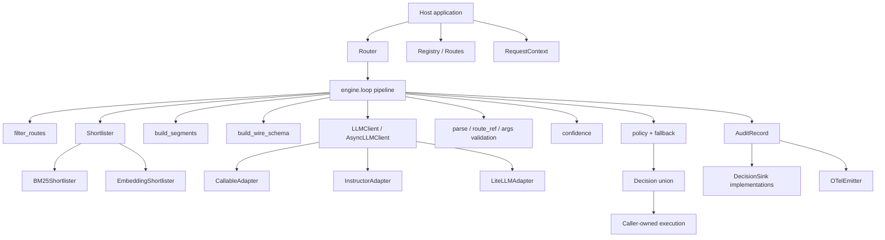
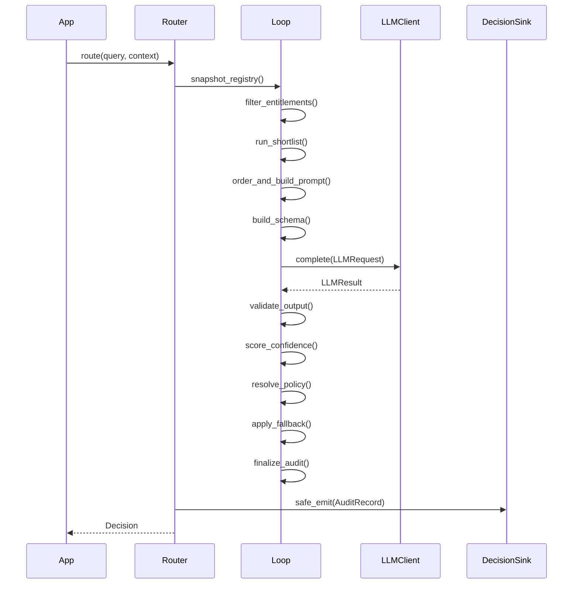
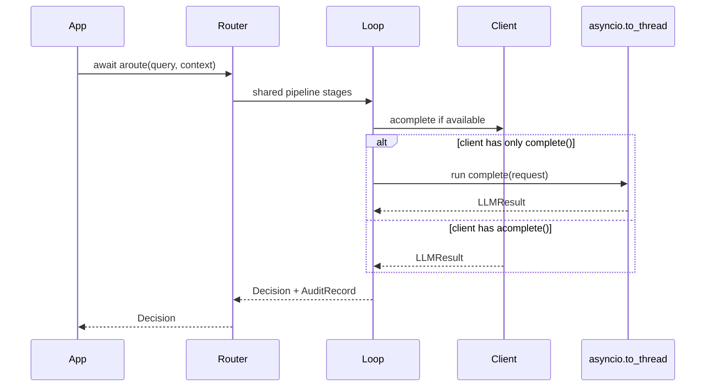
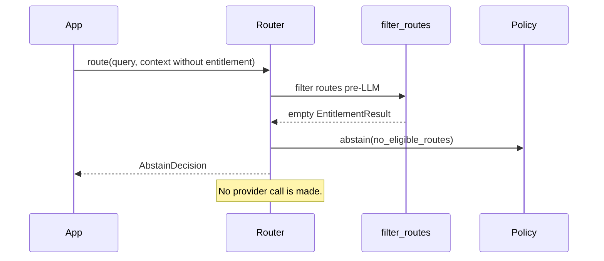
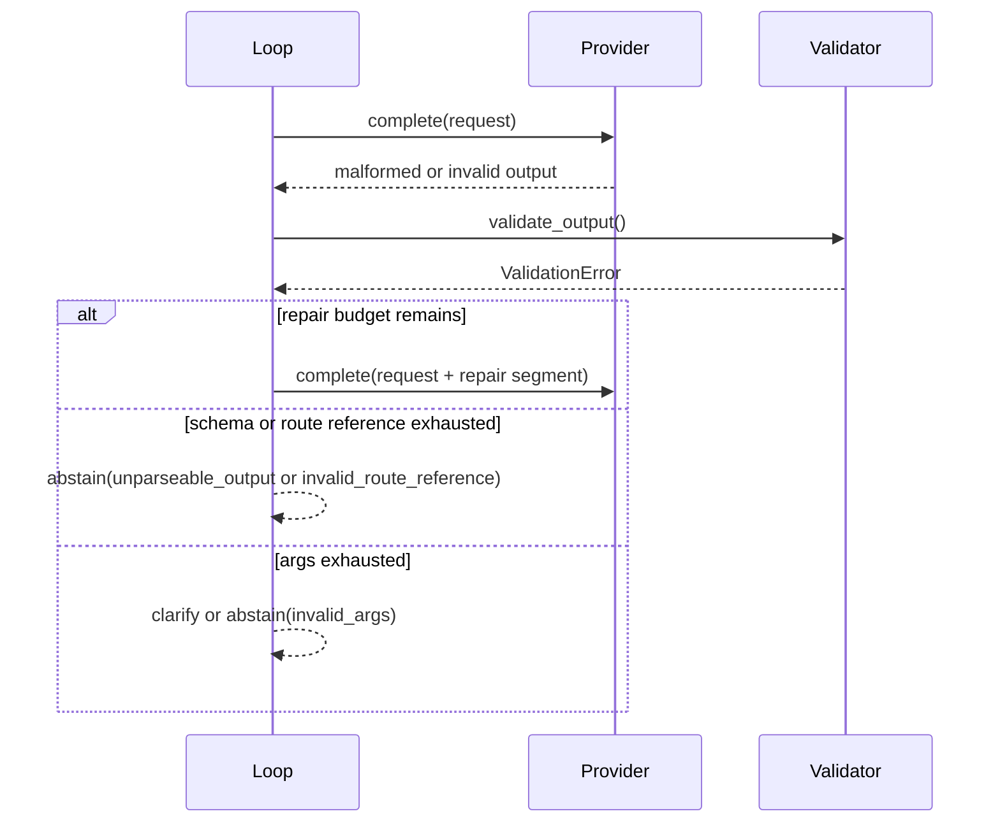
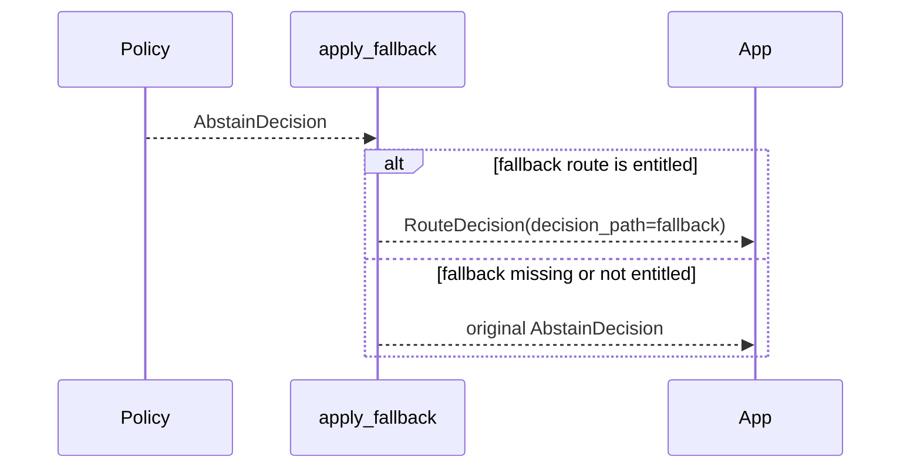

# Architecture
Purpose: Describe the components, runtime topology, main flows, and cross-cutting concerns.
Audience: Engineers changing routing behavior, provider adapters, telemetry, or integrations.
Last verified against commit not-a-git-repository on 2026-08-07.

## Component inventory

| Component | Responsibility | Boundary | Evidence |
|---|---|---|---|
| Public package root | Re-export supported API only; avoid adapter imports. | Names not in `__all__` are internal. | [`switchboard.__init__`](../src/switchboard/__init__.py) |
| Core catalog | Define immutable `Route`, `Registry`, and `RegistryView`. | No provider or framework dependencies. | [`Route`](../src/switchboard/core/route.py), [`Registry`](../src/switchboard/core/registry.py) |
| Request context | Carry per-request tenant, user, entitlements, history, locale, and trace metadata. | Caller resolves slow policy lookups before routing. | [`RequestContext`](../src/switchboard/core/context.py) |
| Router | Resolve config once and drive sync/async decision loops. | Holds no per-request mutable state. | [`Router.__init__`](../src/switchboard/router.py), [`Router.route`](../src/switchboard/router.py) |
| Engine loop | Own the canonical step pipeline from registry snapshot to audit finalization. | Only provider calls and telemetry I/O leave pure in-process logic. | [`LoopState`](../src/switchboard/engine/loop.py), [`run_pipeline_sync`](../src/switchboard/engine/loop.py), [`run_pipeline_async`](../src/switchboard/engine/loop.py) |
| Entitlements | Filter routes before prompt/provider exposure. | `Registry.view()` is not the security boundary in v0.1; `filter_routes()` is. | [`filter_routes`](../src/switchboard/engine/entitlements.py) |
| Shortlisting | Reduce entitled routes to candidates via auto/BM25/embedding backends. | Backends are untrusted on entitlements; router re-intersects. | [`resolve_shortlister`](../src/switchboard/engine/shortlist.py), [`BM25Shortlister`](../src/switchboard/engine/shortlist.py) |
| Prompt/schema/validation | Build cache-shaped prompt segments, per-call output schema, and layered output checks. | Model output is validated before policy resolution. | [`build_segments`](../src/switchboard/engine/prompt.py), [`build_wire_schema`](../src/switchboard/engine/schema.py), [`validate_output`](../src/switchboard/engine/loop.py) |
| Confidence/policy | Compute confidence and map validated wire output to typed decisions. | Thresholds are downgrade-only; fallback is marked separately. | [`build_confidence_report`](../src/switchboard/engine/confidence.py), [`resolve_decision`](../src/switchboard/engine/policy.py) |
| Provider layer | Normalize provider requests/results and capability rungs. | SDK imports are optional and lazy. | [`LLMRequest`](../src/switchboard/providers/base.py), [`resolve_client`](../src/switchboard/providers/__init__.py) |
| Telemetry | Emit audit records to sinks and optional OTel spans. | Sink/span failures must not fail routing. | [`DecisionSink`](../src/switchboard/telemetry/emitter.py), [`OTelEmitter`](../src/switchboard/telemetry/otel.py) |
| Eval harness | Freeze catalogs, replay provider calls, score suites and baselines. | Pydantic + stdlib only; CLI is deferred. | [`run_suite`](../src/switchboard/evals/harness.py), [`ReplayClient`](../src/switchboard/evals/cache.py) |

## Runtime topology and deployment model

Switchboard is a library embedded in the host application process. There are no repository-defined containers, hosts, queues, schedulers, daemons, migrations, or IaC files. A typical runtime is:

1. Application process creates one long-lived [`Registry`](../src/switchboard/core/registry.py).
2. Application process creates one long-lived [`Router`](../src/switchboard/router.py) with a provider client and optional sink.
3. Each request creates a per-call [`LoopState`](../src/switchboard/engine/loop.py).
4. The router makes zero or more provider calls through [`LLMClient.complete`](../src/switchboard/providers/base.py) or [`AsyncLLMClient.acomplete`](../src/switchboard/providers/base.py).
5. The router emits one [`AuditRecord`](../src/switchboard/core/audit.py) to the configured sink and optional spans.
6. The host application executes the selected route, if any.

## System component diagram

## Main request/data paths

### 1. Normal sync route decision

Evidence: [`Router.route`](../src/switchboard/router.py) delegates this order to [`run_pipeline_sync`](../src/switchboard/engine/loop.py); the stage implementations live in [`engine.loop`](../src/switchboard/engine/loop.py).

### 2. Async route decision with sync client

Evidence: [`Router.aroute`](../src/switchboard/router.py) delegates to [`run_pipeline_async`](../src/switchboard/engine/loop.py), while [`_timed_call_async`](../src/switchboard/engine/loop.py) offloads sync-only clients with `asyncio.to_thread`.

### 3. No eligible routes path

Evidence: [`filter_entitlements`](../src/switchboard/engine/loop.py) sets an abstain decision when `result.routes` is empty, and [`filter_routes`](../src/switchboard/engine/entitlements.py) filters `Route.requires` and `Route.visibility`.

### 4. Validation repair and degradation

Evidence: [`run_decision_sync`](../src/switchboard/engine/loop.py), [`validate_output`](../src/switchboard/engine/loop.py), and [`format_error_for_repair`](../src/switchboard/engine/validate.py).

### 5. Terminal fallback substitution

Evidence: [`apply_fallback`](../src/switchboard/engine/policy.py) substitutes only `AbstainDecision` and preserves the pre-fallback reason in audit.

## Cross-cutting concerns

### Auth, authorization, tenancy, and scoping

Switchboard does not authenticate users. The host application supplies identity and claims through [`RequestContext`](../src/switchboard/core/context.py). Authorization is implemented as pre-LLM route filtering in [`filter_routes`](../src/switchboard/engine/entitlements.py), using `Route.requires` and `Route.visibility`. Tenant identifiers are not rendered into prompts by [`build_segments`](../src/switchboard/engine/prompt.py); raw tenant IDs remain in audit records while OTel spans hash them by default through [`AuditRecord.as_otel_attributes`](../src/switchboard/core/audit.py).

### Logging and errors

The governing error rule is encoded in [`errors.py`](../src/switchboard/errors.py): broken caller configuration or provider transport failures raise typed `SwitchboardError` subclasses, while model uncertainty and unusable model output degrade to `Decision` outcomes. Telemetry failures are rate-limit logged and swallowed by [`safe_emit`](../src/switchboard/telemetry/emitter.py) and [`_never_fails`](../src/switchboard/telemetry/otel.py).

### Retries

Transport and schema retry budgets are separate in [`RetrySpec`](../src/switchboard/engine/loop.py). Provider timeouts and rate limits retry with exponential backoff and optional jitter; auth errors do not retry. Schema repair appends a repair segment after the query and forces retry temperature to zero in [`_repair_request`](../src/switchboard/engine/loop.py).

### Caching

There are three cache-related layers:

- Prompt segment cache keys from [`segment_a_cache_key`](../src/switchboard/engine/prompt.py) and [`segment_b_cache_key`](../src/switchboard/engine/prompt.py).
- Shortlist index keys based on registry version, shortlister fingerprint, and scope in [`_BaseShortlister.index_key`](../src/switchboard/engine/shortlist.py).
- Eval replay cache keys from [`CacheKey`](../src/switchboard/evals/cache.py).

### Background jobs

No background jobs, queues, or daemons are implemented in v0.1. JSONL sink writes synchronously in [`JSONLSink`](../src/switchboard/telemetry/emitter.py); comments state queue-based telemetry hardening is deferred.

### Secrets management

Switchboard does not read provider credential environment variables directly. Provider SDKs are constructed by [`InstructorAdapter`](../src/switchboard/providers/instructor_adapter.py) and [`LiteLLMAdapter`](../src/switchboard/providers/litellm_adapter.py), so credentials are host-application / SDK responsibility.

## Related documents

- [Tech stack](03-TECH-STACK.md)
- [Business logic](05-BUSINESS-LOGIC.md)
- [Configuration](08-CONFIGURATION.md)
- [Operations](10-OPERATIONS.md)
- [ADR index](adr/README.md)
