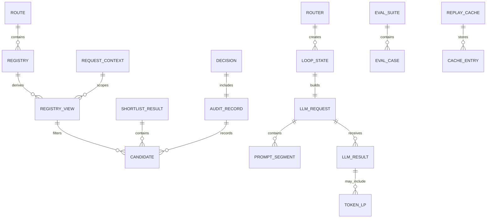

# Data Model
Purpose: Define the canonical entities, fields, relationships, storage surfaces, and lifecycle behavior.
Audience: Engineers changing models, schemas, audit records, eval fixtures, or persisted artifacts.
Last verified against commit not-a-git-repository on 2026-08-07.

## Entity relationship diagram

## Catalog and routing entities

| Entity | Fields | Notes | Evidence |
|---|---|---|---|
| `Route` | `name`, `description`, `args_model`, `examples`, `tags`, `pinned`, `requires`, `visibility`, `clarify_label`, `group`, `metadata` | Frozen Pydantic model. `metadata` is opaque; only its JSON-serializable subset participates in `content_hash`. | [`Route`](../src/switchboard/core/route.py) |
| `Registry` | `_routes`, `_index`, `_content_hash`; derived `routes`, `names`, `content_hash`, `version` | Immutable catalog. Empty registries and duplicate names raise `RegistryError`. Version is a 12-hex prefix of content hash. | [`Registry`](../src/switchboard/core/registry.py) |
| `RegistryView` | `_routes`, `_index`, `_view_hash`, `_registry_version`; derived `routes`, `names`, `view_hash`, `registry_version` | Frozen route slice. May be empty. `Registry.view()` currently returns a passthrough view, while enforcement happens in `filter_routes()`. | [`RegistryView`](../src/switchboard/core/registry.py), [`filter_routes`](../src/switchboard/engine/entitlements.py) |
| `RequestContext` | `tenant_id`, `user_id`, `entitlements`, `entitlement_key`, `fallback_route`, `conversation_id`, `locale`, `history`, `trace_id`, `extra` | Frozen per-request caller state. `has()` checks entitlement membership. | [`RequestContext`](../src/switchboard/core/context.py) |
| `EntitlementResult` | `routes`, `entitlement_key`, `filtered_count`, `predicate_errors`; derived `names`, `allowed`, `cacheable` | Returned by route entitlement filtering. A raising visibility predicate fails closed and is recorded. | [`EntitlementResult`](../src/switchboard/engine/entitlements.py) |
| `Candidate` | `route_name`, `score`, `rank`, `source` | One shortlisted route. `source` is `bm25`, `embed`, `hybrid`, `pinned`, or `all`. | [`Candidate`](../src/switchboard/core/candidates.py) |
| `ShortlistResult` | `candidates`, `skipped`, `weak_retrieval`, `index_key`; derived `names` | Shared result model for all shortlisters and audit records. | [`ShortlistResult`](../src/switchboard/core/candidates.py) |

## Decision entities

| Entity | Fields | Notes | Evidence |
|---|---|---|---|
| Common decision base | `rationale`, `confidence`, `audit`, `decision_path`, `downgraded_from` | Frozen. `model_dump_public()` excludes audit. | [`_DecisionBase`](../src/switchboard/core/decision.py) |
| `RouteDecision` | common fields plus `kind="route"`, `route`, `args` | Fallbacks also use this shape with `decision_path="fallback"` and `args=None`. | [`RouteDecision`](../src/switchboard/core/decision.py) |
| `MultiRouteDecision` | common fields plus `kind="multi_route"`, `routes` | `routes` is a tuple of `RoutedCall`. | [`MultiRouteDecision`](../src/switchboard/core/decision.py) |
| `RoutedCall` | `route`, `args` | One route/args pair in a multi-route decision. | [`RoutedCall`](../src/switchboard/core/decision.py) |
| `ClarifyDecision` | common fields plus `kind="clarify"`, `question`, `candidates`, `missing`, `resume_token` | Clarify is a result, not an exception. `resume_token` is v0.2. | [`ClarifyDecision`](../src/switchboard/core/decision.py) |
| `AbstainDecision` | common fields plus `kind="abstain"`, `reason` | `reason` uses the closed `AbstainReason` vocabulary. | [`AbstainDecision`](../src/switchboard/core/decision.py), [`AbstainReason`](../src/switchboard/core/audit.py) |
| `PlanDecision` | common fields plus `kind="plan"`, `steps` | Defined in v0.1 but not emitted until v0.5. | [`PlanDecision`](../src/switchboard/core/decision.py) |
| `PlanStep` | `route`, `args`, `depends_on` | One dependency-aware plan step. | [`PlanStep`](../src/switchboard/core/decision.py) |

## Audit and confidence entities

| Entity | Fields | Notes | Evidence |
|---|---|---|---|
| `ConfidenceReport` | `score`, `method`, `p_route`, `margin`, `agreement`, `vote_overturned`, `stated`, `thresholds` | Same object appears on `Decision` and `AuditRecord`; `score` is not a calibrated probability. | [`ConfidenceReport`](../src/switchboard/core/audit.py) |
| `LatencyBlock` | `total_ms`, `shortlist_ms`, `llm_ttft_ms`, `llm_total_ms`, `validation_ms` | Per-stage timings in milliseconds. | [`LatencyBlock`](../src/switchboard/core/audit.py) |
| `CostBlock` | `usd`, `price_table_version`, `breakdown` | Cost is nullable; unknown prices are not guessed. | [`CostBlock`](../src/switchboard/core/audit.py), [`ModelInfo`](../src/switchboard/_models.py) |
| `AuditRecord` | `schema_version`, `decision_id`, timestamps, trace/span IDs, tenant/user hashes, input hashes/text, registry/candidates, decision fields, provider IDs, usage, cost, latency, outcome, error, hash-chain field | Frozen canonical record. It is projected to OTel attributes and training rows. Payload fields are content-mode gated. | [`AuditRecord`](../src/switchboard/core/audit.py) |
| `AuditDraft` | Mutable mirrors of `AuditRecord` plus stage timing and idempotent `_record` cache | Per-call accumulator; finalized exactly once. | [`AuditDraft`](../src/switchboard/core/audit.py) |

## Provider entities

| Entity | Fields | Notes | Evidence |
|---|---|---|---|
| `PromptSegment` | `role`, `content`, `cache`, `cache_key` | One cache-addressable prompt slice. | [`PromptSegment`](../src/switchboard/providers/base.py) |
| `LLMRequest` | `segments`, `output_schema`, `temperature`, `max_tokens`, `want_logprobs`, `seed` | Provider-facing request. | [`LLMRequest`](../src/switchboard/providers/base.py) |
| `TokenLP` | `token`, `logprob`, `top` | Token logprob plus alternatives. | [`TokenLP`](../src/switchboard/providers/base.py) |
| `Usage` | `input_tokens`, `cached_input_tokens`, `output_tokens` | Additive token accounting. | [`Usage`](../src/switchboard/providers/base.py) |
| `LLMResult` | `parsed`, `raw_text`, `token_logprobs`, `usage`, `model_id`, `attempts`, `provider_meta` | Provider response normalized for validation, confidence, audit, and replay. | [`LLMResult`](../src/switchboard/providers/base.py) |
| `ClientCapabilities` | `structured`, `logprobs`, `caching`, `parallel_tool_calls`, `reasoning_toggle` | Capability rung drives schema mode and confidence behavior. | [`ClientCapabilities`](../src/switchboard/providers/base.py) |

## Configuration entities

Detailed defaults and allowed values are owned by [configuration](08-CONFIGURATION.md). The data model types are:

- [`ClientSpec`](../src/switchboard/router.py): `adapter`, `model`, `temperature`, `want_logprobs`.
- [`ShortlistSpec`](../src/switchboard/router.py): `variant`, `top_k`, `min_routes`, `model`, `backend`.
- [`ConfidenceSpec`](../src/switchboard/router.py): `source`, `vote_n`.
- [`RetrySpec`](../src/switchboard/engine/loop.py): `schema_attempts`, `provider_attempts`, `backoff`, `base_delay`, `max_delay`.
- [`ThresholdPolicy`](../src/switchboard/engine/policy.py): `abstain_below`, `clarify_below`, `margin_clarify_below`, `multi_route_member_min`, `model_id`, `registry_version`.
- [`ModelInfo`](../src/switchboard/_models.py): model capability, price, and deprecation table row.

## Eval and replay entities

| Entity | Fields | Notes | Evidence |
|---|---|---|---|
| `ExpectedRoute` | `kind`, `any_of`, `args`, `args_match` | Gold label for one route. Args scoring is deferred. | [`ExpectedRoute`](../src/switchboard/evals/fixtures.py) |
| `ExpectedMultiRoute` | `kind`, `routes`, `order_sensitive` | Gold label for multi-route. | [`ExpectedMultiRoute`](../src/switchboard/evals/fixtures.py) |
| `ExpectedClarify` | `kind`, `missing`, `acceptable_routes` | Clarify is a first-class gold label. | [`ExpectedClarify`](../src/switchboard/evals/fixtures.py) |
| `ExpectedAbstain` | `kind` | Gold label for out-of-scope. | [`ExpectedAbstain`](../src/switchboard/evals/fixtures.py) |
| `EvalCase` | `id`, `query`, `context`, `expected`, `tags`, `source` | One labeled query. | [`EvalCase`](../src/switchboard/evals/fixtures.py) |
| `EvalSuite` | `name`, `cases`, `catalog` | Suite with optional pinned catalog. | [`EvalSuite`](../src/switchboard/evals/fixtures.py) |
| `CacheKey` | `model`, `prompt_hash`, `schema_hash`, `temperature`, `seed`, `sample_index` | Content address for replayed provider calls. | [`CacheKey`](../src/switchboard/evals/cache.py) |
| `CacheEntry` | `key`, `raw_text`, `model_id`, `usage`, `token_logprobs`, `attempts`, `provider_meta` | Replay stores raw provider output, not generated Pydantic instances. | [`CacheEntry`](../src/switchboard/evals/cache.py) |
| `CaseResult`, `SuiteMetrics`, `ArmResult`, `GateResult`, `SuiteResult` | Scored eval outputs | Metrics are derived from production `Decision` and `AuditRecord`. | [`harness.py`](../src/switchboard/evals/harness.py) |

## Storage engines and persisted artifacts

| Storage surface | Engine / format | What lives there | Evidence |
|---|---|---|---|
| Route registry | In memory | `Route` objects inside frozen `Registry`. | [`Registry`](../src/switchboard/core/registry.py) |
| Shortlist index | In memory by default; optional `IndexStore` bytes | BM25 postings or embedding matrices serialized as JSON bytes. | [`MemoryIndexStore`](../src/switchboard/engine/shortlist.py), [`BM25Shortlister._dump_blob`](../src/switchboard/engine/shortlist.py), [`EmbeddingShortlister._dump_blob`](../src/switchboard/engine/shortlist.py) |
| Audit sink | In memory, JSONL file, callback, or fan-out | Finalized `AuditRecord` models. | [`InMemorySink`](../src/switchboard/telemetry/emitter.py), [`JSONLSink`](../src/switchboard/telemetry/emitter.py), [`CallbackSink`](../src/switchboard/telemetry/emitter.py), [`MultiSink`](../src/switchboard/telemetry/emitter.py) |
| Eval fixtures | JSONL with header `{"fixture": "sb-eval/1"}` | `EvalCase` lines plus optional frozen catalog. | [`FIXTURE_SCHEMA`](../src/switchboard/evals/fixtures.py), [`save_suite`](../src/switchboard/evals/fixtures.py) |
| Replay cache | JSONL with header `{"cache": "sb-replay/1"}` | `CacheEntry` lines keyed by `CacheKey.digest`. | [`CACHE_SCHEMA`](../src/switchboard/evals/cache.py), [`ReplayCache`](../src/switchboard/evals/cache.py) |

There are no database migrations in this repository. Current schema versions are `AuditRecord.schema_version == "1"`, fixture schema `sb-eval/1`, replay cache schema `sb-replay/1`, BM25/embed index blob version `1`, and prompt template version `1`.

## Indexes and constraints

- Route names must match `^[a-z][a-z0-9_\-.:]{0,63}\Z`; enforcement is in [`Route._validate_name`](../src/switchboard/core/route.py).
- A `Registry` must be non-empty and route names must be unique; enforcement is in [`Registry.__init__`](../src/switchboard/core/registry.py).
- `args_model` must be a Pydantic `BaseModel` subclass; enforcement is in [`Route._validate_args_model`](../src/switchboard/core/route.py).
- `registry.version` is a 12-hex prefix of the SHA-256 content hash; derivation is in [`Registry.version`](../src/switchboard/core/registry.py).
- BM25 and embedding index keys combine registry version, shortlister fingerprint, and scope; see [`_BaseShortlister.index_key`](../src/switchboard/engine/shortlist.py).
- Replay cache lookup key is SHA-256 over a canonical `CacheKey`; see [`CacheKey.digest`](../src/switchboard/evals/cache.py).
- Decision union discrimination is on `kind`; see [`Decision`](../src/switchboard/core/decision.py).
- `AbstainReason` is a closed literal vocabulary; see [`AbstainReason`](../src/switchboard/core/audit.py).

## Data lifecycle and retention

- `Registry`, `RequestContext`, decisions, and provider request/response state are in-process objects; Switchboard does not persist them unless a sink/cache is configured.
- `InMemorySink` keeps a bounded ring buffer and increments `dropped` when records are evicted.
- `JSONLSink` appends line-buffered records and does not implement retention, compaction, rotation, or fsync-per-record durability.
- `ReplayCache` is append-only JSONL; re-recording appends a newer line and last-write-wins in memory.
- Content retention is controlled by `content_mode` and the redactor; see [configuration](08-CONFIGURATION.md).

OPEN QUESTION: No repository file defines production retention, rotation, archival, or deletion policies for JSONL audit logs and replay caches.

## Related documents

- [Overview](01-OVERVIEW.md)
- [Business logic](05-BUSINESS-LOGIC.md)
- [Configuration](08-CONFIGURATION.md)
- [Operations](10-OPERATIONS.md)
