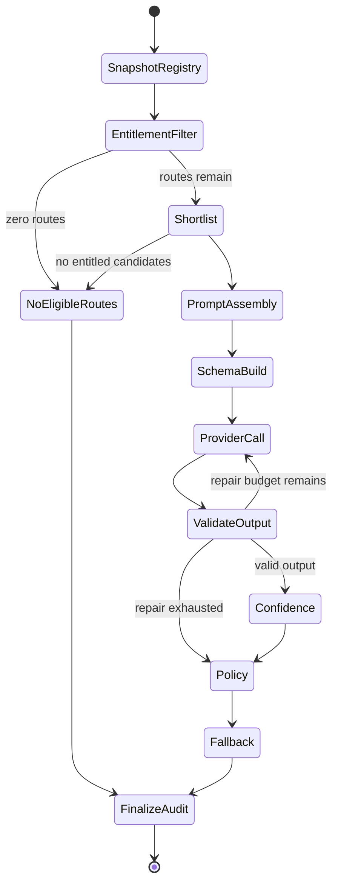
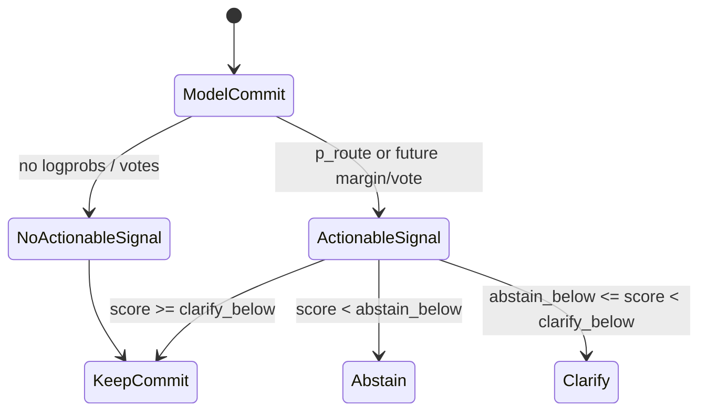
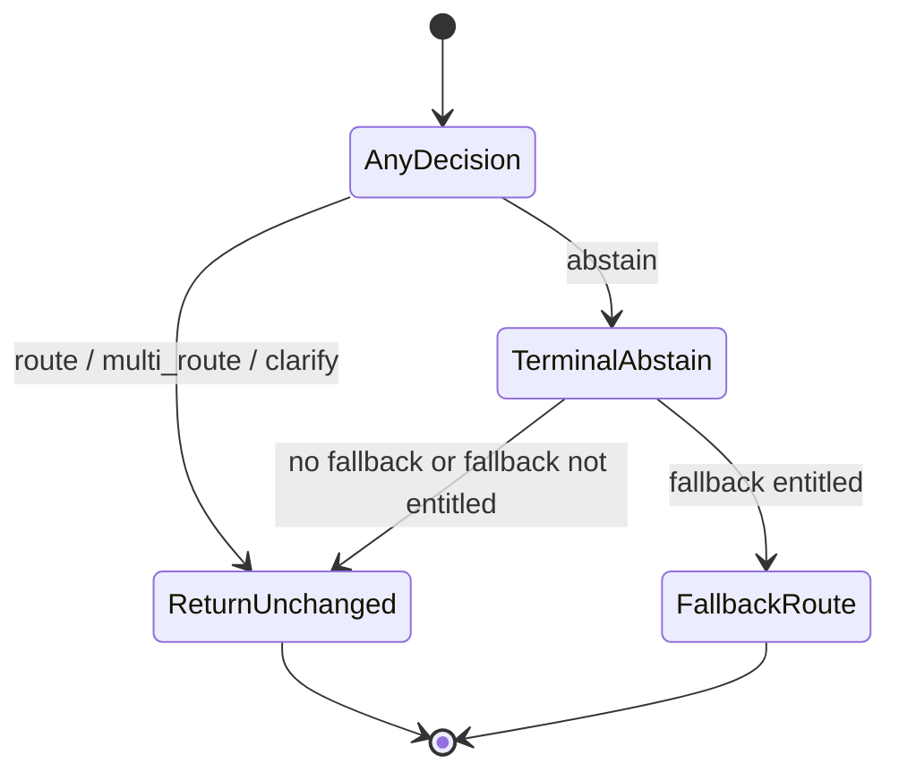

# Business Logic
Purpose: Document the rules the code actually enforces, including validations, state changes, and edge cases.
Audience: Engineers changing routing semantics, validation behavior, confidence policy, or fallbacks.
Last verified against commit not-a-git-repository on 2026-08-07.

## Hard invariants

| Rule | Behavior | Evidence |
|---|---|---|
| Switchboard decides, never executes. | Routes carry metadata but no handler; callers execute after a `Decision`. | [`Route`](../src/switchboard/core/route.py), [`OTelEmitter.execute_tool_span`](../src/switchboard/telemetry/otel.py) |
| Catalog construction fails fast for invalid routes. | Empty registry, duplicate names, malformed names, and invalid `args_model` raise `RegistryError`. | [`Registry.__init__`](../src/switchboard/core/registry.py), [`Route._validate_name`](../src/switchboard/core/route.py), [`Route._validate_args_model`](../src/switchboard/core/route.py) |
| Entitlements are applied before the LLM. | `Route.requires` and `Route.visibility` filter the candidate set before shortlisting and prompt assembly. | [`filter_routes`](../src/switchboard/engine/entitlements.py), [`filter_entitlements`](../src/switchboard/engine/loop.py) |
| Empty eligible routes are not exceptional. | Router returns `abstain(reason="no_eligible_routes")` without a provider call. | [`filter_entitlements`](../src/switchboard/engine/loop.py) |
| Shortlisters are untrusted on entitlements. | Results are re-intersected with `allowed` before prompt assembly. | [`_absorb_shortlist`](../src/switchboard/engine/loop.py) |
| Model output is validated in three layers. | Schema parse, route reference, then args validation. | [`validate_output`](../src/switchboard/engine/loop.py), [`parse_wire_output`](../src/switchboard/engine/validate.py), [`check_route_reference`](../src/switchboard/engine/validate.py), [`validate_args`](../src/switchboard/engine/validate.py) |
| Model/schema failures degrade to decisions, not exceptions. | Bad JSON, invalid route names, and invalid args become abstain or clarify outcomes after repair budget exhaustion. | [`resolve_policy`](../src/switchboard/engine/loop.py), [`_degrade`](../src/switchboard/engine/loop.py) |
| Provider transport errors raise by default. | Retryable provider errors retry; exhaustion raises unless `on_provider_error="abstain"`. | [`_call_provider_sync`](../src/switchboard/engine/loop.py), [`_handle_provider_error`](../src/switchboard/engine/loop.py) |
| Confidence thresholds are downgrade-only. | Thresholds can route -> clarify -> abstain, never promote. | [`resolve_decision`](../src/switchboard/engine/policy.py) |
| Fallback never bypasses entitlements. | Fallback substitution only occurs if fallback route is in the entitled view. | [`apply_fallback`](../src/switchboard/engine/policy.py) |
| Audit records are finalized and emitted even on raised provider errors. | Router finalizes audit in `finally` and emits through safe sink calls. | [`Router.route`](../src/switchboard/router.py), [`finalize_audit`](../src/switchboard/engine/loop.py) |

## Decision loop lifecycle

The stage order is implemented by [`Router.route`](../src/switchboard/router.py) and [`Router.aroute`](../src/switchboard/router.py), and each stage is implemented in [`engine.loop`](../src/switchboard/engine/loop.py).

## Validation and degradation rules

| Condition | Outcome | Evidence |
|---|---|---|
| No routes survive entitlement filtering. | `AbstainDecision(reason="no_eligible_routes")`; no LLM call. | [`filter_entitlements`](../src/switchboard/engine/loop.py) |
| Schema parsing remains invalid after repair attempts. | `AbstainDecision(reason="unparseable_output")`. | [`_degrade`](../src/switchboard/engine/loop.py) |
| Model names a route outside current candidates. | `AbstainDecision(reason="invalid_route_reference")`. | [`check_route_reference`](../src/switchboard/engine/validate.py), [`_reclassify_enum_failure`](../src/switchboard/engine/loop.py) |
| Route choice is valid but args fail validation. | One args repair pass; then `ClarifyDecision` with missing fields when clarify is allowed, otherwise `AbstainDecision(reason="invalid_args")`. | [`_ARGS_REPAIR_BUDGET`](../src/switchboard/engine/loop.py), [`_missing_args_question`](../src/switchboard/engine/loop.py) |
| Provider error exhausted with default policy. | Raise `ProviderError` subclass. | [`_handle_provider_error`](../src/switchboard/engine/loop.py) |
| Provider error exhausted with `on_provider_error="abstain"`. | `AbstainDecision(reason="provider_error")`. | [`resolve_policy`](../src/switchboard/engine/loop.py) |
| Model emits `kind="abstain"`. | `AbstainDecision(reason="model_elected")`. | [`resolve_decision`](../src/switchboard/engine/policy.py) |
| Model emits `kind="clarify"`. | `ClarifyDecision` passes through with model or synthesized question. | [`_model_elected_clarify`](../src/switchboard/engine/policy.py) |

## Confidence and policy rules

Confidence is external to the model where possible. [`compute_p_route`](../src/switchboard/engine/confidence.py) aligns token logprobs to the committed route value. [`signals_are_actionable`](../src/switchboard/engine/confidence.py) implements the no-signal rule: no signal and verbalized-only confidence do not trigger threshold downgrades by default. [`ThresholdPolicy`](../src/switchboard/engine/policy.py) owns default thresholds and provenance checks.

## Shortlisting rules

- `shortlist="auto"` bypasses retrieval when the entitled route count is below `shortlist_min_routes` and otherwise delegates to BM25; see [`AutoShortlister`](../src/switchboard/engine/shortlist.py).
- Default K comes from `effective_k()`: 10 below 150 routes, 15 below 1000, 20 at 1000+, clamped to [5, 20] unless oversized K is explicitly allowed; see [`effective_k`](../src/switchboard/engine/shortlist.py).
- Weak retrieval means fewer than three positive scores. For small catalogs, the full entitled registry is returned; otherwise low-score top-K is passed forward and policy widens the clarify band; see [`_BaseShortlister._assemble`](../src/switchboard/engine/shortlist.py) and [`WEAK_RETRIEVAL_CLARIFY_MARGIN`](../src/switchboard/engine/policy.py).
- Pinned routes are appended if entitled, even when they did not score; see [`_BaseShortlister._assemble`](../src/switchboard/engine/shortlist.py).

## Prompt and schema rules

- The prompt is built as stable system segment, stable route directory, optional query-specific shortlist, then user query last; see [`build_segments`](../src/switchboard/engine/prompt.py).
- Untrusted user input is wrapped in `<user_request>` tags and closing tags are neutralized; see [`_render_query`](../src/switchboard/engine/prompt.py) and [`_neutralize`](../src/switchboard/engine/prompt.py).
- Segment B is always sorted by route name and never shuffled; candidate position-bias mitigation happens in segment C via seeded shuffle; see [`_render_directory`](../src/switchboard/engine/prompt.py) and [`order_candidates`](../src/switchboard/engine/prompt.py).
- Wire schema emits `rationale` before route commitment and validates route names dynamically only on the grammar rung by default; see [`build_wire_schema`](../src/switchboard/engine/schema.py) and [`resolve_schema_mode`](../src/switchboard/engine/schema.py).

## Fallback lifecycle

Fallback result shape is always a `RouteDecision` with `decision_path="fallback"` and `args=None`; the previous abstain reason remains in audit. Evidence: [`apply_fallback`](../src/switchboard/engine/policy.py) and [`RouteDecision`](../src/switchboard/core/decision.py).

## Current defaults that are safe to change with care

These are defaults, not invariants, but changing them changes behavior and should be tested:

- `shortlist_min_routes=25`, `max_candidates=25`, `candidate_order="shuffle"` in [`Router.__init__`](../src/switchboard/router.py).
- `RetrySpec(schema_attempts=2, provider_attempts=3, backoff="expo_jitter")` in [`RetrySpec`](../src/switchboard/engine/loop.py).
- `ThresholdPolicy(abstain_below=0.30, clarify_below=0.55)` in [`ThresholdPolicy`](../src/switchboard/engine/policy.py).
- `content_mode="none"` and `otel=True` in [`Router.__init__`](../src/switchboard/router.py).
- `DEFAULT_MODEL="gemini-2.5-flash-lite"` in [`_models.py`](../src/switchboard/_models.py).

## Related documents

- [Architecture](02-ARCHITECTURE.md)
- [Data model](04-DATA-MODEL.md)
- [Features](06-FEATURES.md)
- [Extending](11-EXTENDING.md)
